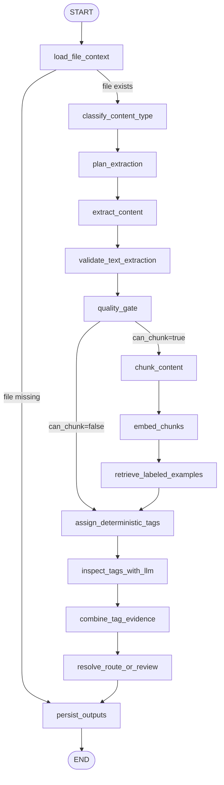

# Current LangGraph Architecture

Last updated: 2026-05-27

## Where The Graph Lives

The production document pipeline graph currently lives in:

```text
packages/extraction/src/sunshine_extraction/langgraph_pipeline.py
```

The graph structure is defined in `build_document_graph()`.

Primary entry points:

- `run_document_graph(...)`: runs one file through the graph.
- `run_document_batch(...)`: runs a batch of QA sample files through the same single-file graph and aggregates artifacts.
- API single-file entry: `apps/api/src/sunshine_api/main.py` via `POST /admin/pipeline/run-file`.
- Dashboard run launcher: API builds commands that call `python -m sunshine_extraction.langgraph_pipeline`.

There is also an older/foundation graph at:

```text
packages/workflows/src/sunshine_workflows/foundation_graph.py
```

That is not the main document extraction/tagging pipeline.

## Current Graph



## Node Responsibilities

| Node | Responsibility | Important outputs |
|---|---|---|
| `load_file_context` | Validates the file exists and builds a `SampleFile` context. Missing files route directly to persistence as failed review items. | `sample`, `source_path`, `relative_path`, file-missing route |
| `classify_content_type` | Assigns broad content class when not provided by corrected metadata. | `content_class.final_class`, confidence, signals |
| `plan_extraction` | Chooses extraction strategy based on class and extension. | `extraction_plan.strategy`, `document_subtype`, `ocr_required` |
| `extract_content` | Runs the selected extractor. This can invoke local OCR through the configured OCR executor. | `extraction_result`, OCR page/doc artifacts, warnings |
| `validate_text_extraction` | Validates extraction output and repairs/escalates where the extraction validator detects poor text. | repaired `extraction_result`, updated plan, added OCR artifacts/warnings |
| `quality_gate` | Scores extracted text quality and decides whether text can be chunked. | `extraction_quality`, `can_chunk` |
| `chunk_content` | Splits extracted text/content into chunks. | `chunks` |
| `embed_chunks` | Embeds chunks using configured embedding provider, with fallback behavior. | `embeddings`, embedding warnings |
| `retrieve_labeled_examples` | Searches the semantic golden-label index for similar reviewed examples. | `semantic_examples` |
| `assign_deterministic_tags` | Produces deterministic/rule-based tag candidates from path, class, plan, and text. | `deterministic_tag_candidates` |
| `inspect_tags_with_llm` | Optionally calls the configured LLM tag inspector using deterministic candidates, semantic examples, taxonomy, and extracted text. | `llm_tag_inspection`, warnings |
| `combine_tag_evidence` | Merges deterministic, semantic, and LLM evidence into final tag candidates. | `tag_candidates` |
| `resolve_route_or_review` | Decides route candidate vs review-required based on tag confidence and extraction quality. | `route` |
| `persist_outputs` | Writes graph-compatible artifacts and final result. | `final_result`, JSONL artifacts |

## Conditional Routing

There are two explicit conditional branches today:

1. `load_file_context`
   - `continue` -> `classify_content_type`
   - `persist` -> `persist_outputs`

2. `quality_gate`
   - `chunk` -> `chunk_content`
   - `route` -> `assign_deterministic_tags`

The second branch means documents with unusable or unchunkable extraction still get tag routing based on metadata/path/context, but they skip chunk embedding and semantic retrieval.

## Current Artifacts

Single-file graph runs write:

- `graph-result.json`
- `graph-audit-events.jsonl`
- `sample-pipeline-results.jsonl`
- `sample-review-queue.jsonl`
- `sample-inputs.jsonl`
- `sample-extraction-results.jsonl`
- `sample-ocr-pages.jsonl`
- `sample-ocr-documents.jsonl`
- `sample-chunks.jsonl`
- `sample-embeddings.jsonl`
- `sample-semantic-examples.jsonl`
- `sample-llm-tag-inspections.jsonl`
- `sample-tag-candidates.jsonl`

Batch runs aggregate those same per-file artifacts into the selected output directory.

## Current State Object

The graph state is `DocumentPipelineState`. It carries:

- file identity and run metadata
- content classification
- extraction plan/result/quality
- OCR page/document artifacts
- chunks and embeddings
- semantic examples
- deterministic and LLM tag evidence
- route/review decision
- warnings, errors, and audit events

## What Is Real Today vs Still Evolving

Implemented today:

- Single-file LangGraph execution
- Batch wrapper over the single-file graph
- SQLite checkpoint support
- OCR execution through configured OCR executor
- extraction validation/repair node
- chunking and embeddings
- semantic example retrieval from golden-label index
- deterministic tag candidates
- optional LLM tag inspection
- combined tag evidence
- route/review decision
- artifact persistence and dashboard import

Still evolving:

- More explicit cost-aware OCR escalation policy
- More explicit LLM-call gating policy
- Stronger cached model-call reuse by file/text hash
- More granular branch routing for OCR fallback vs extraction failure vs tag uncertainty
- Graph visualization/export command for automatic Mermaid generation
