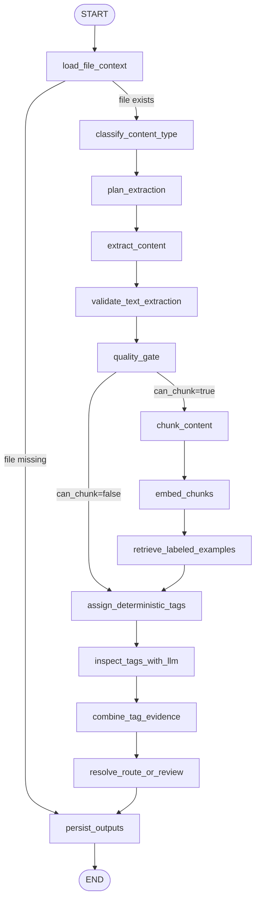
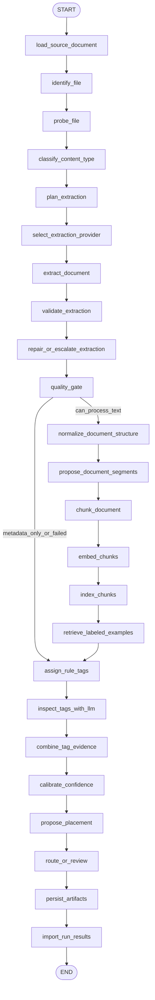

# Sunshine Club Pipeline

Last updated: 2026-05-28.

## Corpus Overview

Phase 1 source root: `/mnt/sunshine` on Atlas VM.

**Mounted corpus shape** (last checked 2026-05-25):

| Area | Files | Size |
|---|---:|---:|
| `archive-2026-05-25` | 8,116 | 37.829 GiB |
| `Sunshine shared folders` | 557 | 9.675 GiB |
| `Paige Agent Sunshine Files` | 548 | 0.585 GiB |
| `From Mac Sunshine Pass 2026-05-25` | 165 | 0.082 GiB |
| `google-drive-delta-2026-05-25` | 77 | 0.016 GiB |
| `_manifest` | 19 | 0.060 GiB |

**Full manifest**: 31,910 rows / ~150 GiB. **Image-heavy** — corpus is dominated by `jpg` (21,655 files / 121 GiB), `jpeg` (7,245 / 13 GiB), `tif` (1,039 / 11.8 GiB). Do not assume most files are born-digital text documents.

**Latest inventory run** (`sunshine-club-inventory-2026-05-25`):
- Scanned: 32,111 | Emitted: 31,513 | Skipped: 598
- Content classes: `scanned_document` 26,400, `image` 3,386, `document` 1,275, `spreadsheet` 234, `code_or_workspace_artifact` 112, `binary_or_unknown` 55, `manifest` 35, `presentation` 9, `email` 7

**Latest probe run** (`sunshine-club-probe-2026-05-25`): 32,467 rows probed. 266 content-class changes. Notable transitions: `image→scanned_document` 93, `scanned_document→document` 131.

**Extraction plan** (`extraction-plan.jsonl`): 32,467 rows. Strategies: `ocr_page_level` 26,058, `photo_metadata` 6,072, `text_extraction` 255, `spreadsheet_table_extraction` 1, `deferred_technical` 81.

## Content Classes and Extraction Strategies

Content classes are assigned during inventory and may be revised after extraction:

| Class | Assignment hint | Extraction strategy |
|---|---|---|
| `scanned_document` | PDF/image/TIFF likely containing a document, receipt, scan, scrapbook | `ocr_page_level` |
| `document` | Born-digital PDF, Word, Markdown, text, HTML | `text_extraction` (OCR fallback if empty) |
| `image` | Photo-first files: jpg, jpeg, png, heic, avif, gif | `photo_metadata` |
| `spreadsheet` | xlsx, xls, csv, tsv | `spreadsheet_table_extraction` |
| `presentation` | pptx and deck formats | `text_extraction` |
| `email` | eml, msg | text extraction preserving headers/body/attachments |
| `google_native_export` | Google Docs/Sheets/Slides exported from Drive | Docling |
| `manifest` | Inventory, copy logs, comparison outputs | Ingest for audit/provenance; exclude from user search/chat |
| `code_or_workspace_artifact` | Python, TypeScript, config, cache, agent workspace | Ingest for audit only; exclude from user search/chat |
| `binary_or_unknown` | Everything else | `deferred_technical` until reviewed |

**Content-class revision**: extraction evidence can upgrade a class (e.g., `image → scanned_document` when OCR finds strong text/layout). Revisions must be recorded as content-class transition records with before/after class, transition reason, extractor name/version, extraction quality, and warnings.

### Extraction Planning

The extraction planner (runs before any extraction) turns each content-class decision into a concrete strategy record:

```json
{
  "source_path": "...",
  "final_class": "scanned_document",
  "strategy": "ocr_page_level",
  "ocr_required": true,
  "page_level": true,
  "preserve_layout": true,
  "search_enabled": true,
  "chat_enabled": false,
  "quality_gate_required": true,
  "planning_reasons": ["final_class=scanned_document", "scrapbook note detected"]
}
```

Every file gets exactly one of: a concrete plan, a technical-defer reason, or an explicit exclusion reason. No file silently disappears.

### OCR and Document Extraction

**Primary OCR path (scanned_document):** OCRmyPDF + Tesseract. Preserves: raw text, normalized pages/blocks/paragraphs/tables, page numbers, coordinates, extractor/model name and version, preprocessing decisions (rotation, deskew, contrast), confidence and detected-language signals, warnings (low contrast, handwriting, skew, empty text).

**Docling integration (current direction):** Replace fragile custom OCR/text extraction with Docling as a new extraction provider behind the existing extraction boundary. Use Docling for: standard PDF/image conversion, layout-aware parsing, table structure extraction, Markdown/JSON export, VLM pipeline against local Cortex endpoint. Keep current OCR as fallback until Docling proves better on QA sample. **Production rule: all model calls must target Cortex or another local endpoint — customer documents must not leave local infrastructure.**

**Photo workflow:** Bypass normal text-centric semantic routing for low-text photos. Use EXIF/captured date, path context, folder-derived event/year, filename clues. Route true photos by year/event/review status. Allow OCR to upgrade `image → scanned_document` when text/layout evidence is strong.

**Spreadsheets:** Preserve workbook, sheet names, rows, date-like columns, and table context. Classify spreadsheet purpose after extraction (membership, finance, event tracker, inventory, system manifest). Inventory spreadsheets route to `system_exports_logs`.

**Emails:** Preserve headers, sender, recipients, sent date, subject, body, attachments, and original folder. Treat emails with private member/donor data as restricted. Classify body and attachments separately where needed.

**Low-quality extraction lowers classifier trust and can force review.** Extraction artifacts must preserve quality (`ok`, `poor`, `metadata_only`, `empty`, `deferred`, `failed`) and warnings.

## Current LangGraph Graph

Production document pipeline: `packages/extraction/src/sunshine_extraction/langgraph_pipeline.py`
Graph built by `build_document_graph()`. V2 target: `packages/extraction/src/sunshine_extraction/graph/` (see `backend_refactor` notes in `dashboard.md`).

### Current Graph (V1)



### Node Responsibilities

| Node | Responsibility |
|---|---|
| `load_file_context` | Validates file exists, builds `SampleFile` context. Missing files route to `persist_outputs` as failed review items. |
| `classify_content_type` | Assigns broad content class when not provided by corrected metadata. |
| `plan_extraction` | Chooses extraction strategy based on class and extension. |
| `extract_content` | Runs selected extractor; can invoke local OCR through configured OCR executor. |
| `validate_text_extraction` | Validates extraction output; repairs/escalates where poor text is detected. |
| `quality_gate` | Scores extracted text quality and decides whether text can be chunked. |
| `chunk_content` | Splits extracted text/content into chunks. |
| `embed_chunks` | Embeds chunks using configured embedding provider with fallback behavior. |
| `retrieve_labeled_examples` | Searches semantic golden-label index for similar reviewed examples. |
| `assign_deterministic_tags` | Produces rule-based tag candidates from path, class, plan, and text. |
| `inspect_tags_with_llm` | Calls configured LLM (Cortex `gemma4-26b` by default) with structured prompt. |
| `combine_tag_evidence` | Merges deterministic, semantic, and LLM evidence into final tag candidates. |
| `resolve_route_or_review` | Decides route candidate vs review-required based on confidence and extraction quality. |
| `persist_outputs` | Writes durable artifacts and audit events. |

### Route Statuses

`route_candidate`, `review_low_confidence_tag`, `review_ocr_quality`, `review_ocr_no_text`, `review_no_tag_candidate`, `review_failed_extraction`, `review_content_class_unknown`, `technical_followup`.

### V2 Target Graph



Key V2 additions: explicit `probe_file`, `select_extraction_provider` (pluggable), `validate_extraction` + `repair_or_escalate_extraction`, `normalize_document_structure`, `propose_document_segments` (file segmentation), `index_chunks` (Qdrant), `calibrate_confidence`, `propose_placement`.

## Provider Strategy

**Principle:** LangGraph owns orchestration, state, audit, routing, and human review. Providers own specialized capabilities (parsing, OCR, chunking, embeddings, retrieval, reranking, LLM calls).

The pipeline structure should be:
```
LangGraph node
  → provider interface
    → selected provider implementation
  → normalized Sunshine artifact
  → validation gate
  → deterministic routing decision
```

Do **not** replace LangGraph with RAGFlow, Dify, Langflow, Haystack, or another workflow/runtime. Those become providers inside nodes, not orchestrators.

**Model call policy:** Every local model call writes usage rows with provider, model, purpose, runtime, token counts, host, and error. Production policy is **local-only**. Third-party API integrations may exist only as disabled development adapters.

## Semantic Tagging and Evaluation

### Current Problem

Observed tagging failure modes:
- Incidental words dominate results (e.g., `Tea` in a filename makes a history doc → `annual_spring_tea`)
- Deterministic rules are too shallow for archival records
- LLM tagging not yet grounded in trusted examples
- Confidence scores describe pipeline agreement, not real-world correctness

### Tagging Loop

1. Human reviews files and creates golden labels.
2. Rebuild semantic index (embeddings of golden-label text snippets).
3. `retrieve_labeled_examples` node finds similar labels for each new file.
4. `inspect_tags_with_llm` uses taxonomy definitions + retrieved examples + extracted text.
5. `combine_tag_evidence` merges deterministic + semantic + LLM evidence.
6. Evaluate results against golden labels. Measure primary accuracy, confusion pairs, review rate.

**Required before broad classification:** Build a 50–100 file golden labeling set including Tea folders, a finance workbook, a yearbook/OCR item, a scrapbook page, a true photo, a scanned obituary, an email, a governance/policy doc, a dental program item, and a manifest/workspace artifact.

### Confidence Calibration

When LLM and deterministic tag **agree**: increase confidence.
When they **disagree**: keep both candidates, route lower-confidence cases to review.
Never let the LLM overwrite the audit trail.

## Current Artifacts

Single-file graph runs write:
- `graph-result.json`
- `graph-audit-events.jsonl`
- `sample-pipeline-results.jsonl`
- `sample-review-queue.jsonl`
- `sample-inputs.jsonl`
- `sample-extraction-results.jsonl`
- `sample-ocr-pages.jsonl`
- `sample-ocr-documents.jsonl`
- `sample-chunks.jsonl`
- `sample-embeddings.jsonl`
- `sample-semantic-examples.jsonl`
- `sample-llm-tag-inspections.jsonl`
- `sample-tag-candidates.jsonl`

Batch runs aggregate those same per-file artifacts into the selected output directory, plus `graph-batch-summary.json` and per-file `graph-runs/` folders.

## Sample Commands

Single-file run:
```bash
.venv/bin/python -m sunshine_extraction.langgraph_pipeline \
  --input-file "/mnt/sunshine/_manifest/.../001 - 2006_May_Sunshine_Tea_2006_0014_a.jpg" \
  --source-path "Sunshine shared folders/Teas/2006_May_Sunshine_Tea_2006/..." \
  --output-dir "/mnt/sunshine/_manifest/.../langgraph-smoke" \
  --checkpoint-path "/mnt/sunshine/_manifest/.../langgraph-smoke/checkpoints.sqlite" \
  --retry-attempts 2 \
  --enable-llm-tags \
  --llm-tag-provider cortex
```

Batch run:
```bash
.venv/bin/python -m sunshine_extraction.langgraph_pipeline \
  --input-root "/mnt/sunshine/_manifest/.../qa samples" \
  --output-dir "/mnt/sunshine/_manifest/.../langgraph-sample-batch" \
  --checkpoint-path "...checkpoints.sqlite" \
  --retry-attempts 2 \
  --max-concurrency 1 \
  --rate-limit-seconds 0 \
  --enable-llm-tags \
  --llm-tag-provider cortex
```

Import results into review DB:
```bash
curl -X POST http://localhost:8000/admin/review/import-langgraph-output \
  -H 'Content-Type: application/json' \
  -d '{"output_dir":"/mnt/sunshine/_manifest/.../langgraph-sample-batch-cortex"}'
```

## Operational Workflows

### 1. Historical Google Drive Cleanup

Only begins after staged corpus is organized locally and imported into Drive. For initial build-out, existing Drive material should first be copied into `/mnt/sunshine` instead of being processed live.

Steps: ingest existing Drive files → extract text and metadata → classify to primary tag and optional secondary facets → detect possible duplicates → compare current location with expected tag-based location → create review tasks for low-confidence, duplicates, possible misfiled files → after admin approval, enqueue move actions.

**Rule:** Historical files are never broadly reorganized without review.

### 2. NAS Staging and Migration

Phase 1 workflow. Read `/mnt/sunshine` corpus → assign source collection and initial content class → extract metadata/text/quality through content-class path → revise content class when extraction proves initial class wrong → classify into tag system when semantically routable → detect duplicates → determine Drive destination → prepare import actions → keep original NAS copies during MVP.

**Rules:** Drive becomes canonical after organized import. NAS content retained as archive. Imported files do not delete or rewrite originals automatically.

### 3. User Upload Intake

Steady-state flow: user uploads through dashboard → file written to universal intake folder in Drive → extract and classify → if duplicate ambiguity, create duplicate review task → if low confidence or small margin, create review task → if safe: assign primary tag + secondary facets + policy → persist classification → enqueue move action → file moved to canonical destination.

### 4. Duplicate Review

Handles exact duplicates, near duplicates, and possible newer versions.

Admin decisions: keep existing canonical and suppress new item / keep both as distinct items / treat new item as newer replacement.

Files in duplicate review do not enter normal routing or learning until resolved.

### 5. Low-Confidence Review

Admin can: assign existing primary tag, create new primary tag, leave note, retry classification, mark ignore.

### 6. Ignore Workflow

Ignored files enter terminal ignored state. Excluded from: auto-routing, learning, normal search, normal chat. May remain visible in admin-only views.

### 7. Misfiled File Review

Detect mismatch on ingest or reconciliation → create review task → admin decides: tag should change, mapping should change, or file should move back.

### 8. Tag Mapping Change Workflow

Admin changes folder mapped to a primary tag → create migration batch → compute affected file count → show conflicts/blocked items → after approval, enqueue bulk move actions → track progress and failures separately.

### 9. Missing Destination Workflow

Store semantic assignment → block move execution → create admin error task → wait for admin to relink tag to an existing folder or create the intended folder manually.

### 10. Search Workflow

Supports: natural-language semantic search, explicit tag filtering, secondary facet filtering, related file discovery, open-in-Drive links.

Ignored and unresolved intake items excluded from normal user search. Restricted, donor-sensitive, beneficiary-sensitive, treasurer-only, legal/IRS-sensitive, member-private, and system-admin files also excluded unless user and workflow are authorized.

### 11. Chat Workflow

Answers from the full semantic graph. Uses citations and links. Not restricted to same-tag files. Explains why a file is related or how it was routed. Obeys same privacy/access and processing-status filters as search.

### 12. Taxonomy and Facet Workflow

Seed canonical folders, primary tags, secondary facet values, placement rules, default privacy, and reviewer roles from the Verdify JSON/workbook. Keep one applied primary routing tag per routed file. Assign secondary facet values for all required facet groups. Enforce privacy/access as policy. Use handoff retrieval questions and golden examples as acceptance tests. Freeze a taxonomy version only after a 50–100 item golden sample is hand-labeled and passes review.

### 13. Photo Workflow

Skip semantic tagging when extraction is too weak. Route with `historical_photos` primary tag when item is a true photo/media record (e.g., `06_History_Archive/{captured_year}`). Use EXIF/captured dates, folder context, event names, and filename clues before falling back to upload/import date. Keep scan-like TIFF/JPEG/PDF files eligible for OCR before deciding they are pure photos.

### 14. Manifest and Workspace Artifact Workflow

Ingest with source collection and original path preserved → assign `manifest` or `code_or_workspace_artifact` content class → store extraction output only if it helps audit/debugging/lineage → exclude from normal search/chat unless admin explicitly promotes the file.

## Safety Rules

- Do not delete duplicate-looking files from the NAS pass without review.
- Treat filename+size duplicate detection as conservative evidence, not final truth.
- Preserve original source path and source collection for every row.
- Keep the NAS copy as archive during MVP even after Drive import.
- Do not modify, move, delete, or overwrite customer source files during pipeline execution.
- Every input file must reach one terminal state: routed, review required, technical follow-up, or failed with recorded reason.
- Low-quality OCR must route to review, not be silently accepted.
