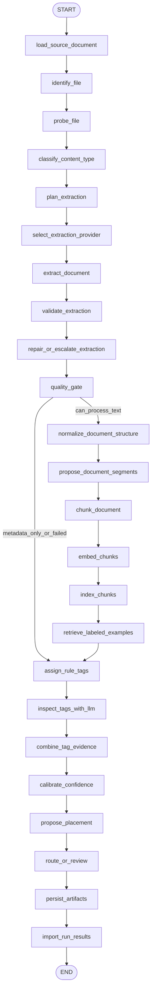

# Sunshine Club V2 End-to-End Architecture

## Status

Accepted direction. Implementation is incremental on the feature branch; this
document remains the target-state contract until the V2 rebuild is complete.

Branch:

```text
feature/v2-end-to-end-design
```

## Executive Summary

V1 proved the shape of the product:

- classify files.
- extract/OCR content.
- chunk and embed content.
- retrieve similar reviewed examples.
- assign primary/secondary tags.
- calibrate confidence.
- route to accepted/review/deferred/failed.
- write artifacts.
- inspect and correct results in a dashboard.

V2 should keep the same product goal but rebuild the codebase around clearer boundaries:

- **LangGraph remains the deterministic control plane.**
- **Open-source/provider tools become replaceable node providers.**
- **Sunshine-specific policy stays in-house.**
- **Dashboard remains the operational/review surface.**
- **Temporal becomes the later durable batch execution layer, not the per-file intelligence graph.**

The implementation should be incremental, but the target architecture should be clean enough that we can build toward it without continuing to grow `sample_pipeline.py` and API route files into large mixed-responsibility modules.

## Product Goal

Build a production-ready document intelligence and archival organization pipeline for Sunshine Club that can process single files and batches through deterministic, auditable workflows.

The system must:

- never silently lose data.
- clearly mark uncertain files for review.
- preserve source-file provenance.
- support local-first model execution through Cortex.
- keep documents and model calls inside local infrastructure.
- expose progress, provider usage, model usage, costs, quality, and review decisions in the dashboard.
- support continuous improvement through golden labels and provider benchmarks.

## Non-Goals

- Do not replace LangGraph with RAGFlow, Dify, Langflow, Haystack, or another workflow/runtime.
- Do not replace the dashboard with an external RAG app.
- Do not make a full production Temporal migration in the same slice as provider cleanup.
- Do not call third-party APIs for customer documents.
- Do not trust parser/provider confidence without Sunshine validation gates.
- Do not modify customer source files.
- Do not attempt to implement every provider at once.

## Design Principles

1. **Deterministic graph, pluggable tools**
   - LangGraph owns node order, state, routing, and audit.
   - Providers own specialized work: parsing, OCR, chunking, embeddings, retrieval, reranking, LLM calls.

2. **Fail closed**
   - Provider failures route to review or technical follow-up.
   - Bad OCR/text never becomes accepted solely because a provider returned a confident answer.

3. **Artifacts are contracts**
   - Dashboard, eval, review import, and run reports consume normalized artifacts.
   - Provider-specific raw output can be saved separately, but normalized artifacts remain stable.

4. **Model calls are visible**
   - Every local model call writes usage rows with provider, model, purpose, runtime, token counts when available, host, and error.
   - Production policy is local-only. Third-party API integrations may exist only as disabled development adapters and must not be part of accepted production routing.

5. **Use open source where it removes real complexity**
   - Use Docling/MinerU/RAGFlow DeepDoc/Unstructured for parsing benchmarks.
   - Use Qdrant for vector storage.
   - Use Onyx/LlamaIndex selectively for connectors.
   - Keep routing, confidence, review, taxonomy, and placement policy in-house.

## Target System View

```text
External Sources
  filesystem / future connectors
      |
      v
FastAPI + Dashboard
  start run / inspect file / review decisions / golden labels
      |
      v
Run Executor
  V2 now: subprocess or local worker
  V2 later: Temporal workflow
      |
      v
LangGraph Document Pipeline
  deterministic state graph
  provider-backed nodes
  normalized artifacts
      |
      +--> Postgres dashboard/run database
      +--> File artifacts JSONL/JSON
      +--> Local vector database
      +--> Observability traces
```

## V2 LangGraph

### Full Node List

```text
START
  load_source_document
  identify_file
  probe_file
  classify_content_type
  plan_extraction
  select_extraction_provider
  extract_document
  validate_extraction
  repair_or_escalate_extraction
  quality_gate
  normalize_document_structure
  propose_document_segments
  chunk_document
  embed_chunks
  index_chunks
  retrieve_labeled_examples
  assign_rule_tags
  inspect_tags_with_llm
  combine_tag_evidence
  calibrate_confidence
  propose_placement
  route_or_review
  persist_artifacts
  import_run_results
END
```

### Graph Flow



### Conditional Edges

| From | Condition | To |
| --- | --- | --- |
| `load_source_document` | source missing | `persist_artifacts` with failed review route |
| `quality_gate` | text can be processed | `normalize_document_structure` |
| `propose_document_segments` | long PDF/page collection has separable items | `chunk_document` with segment metadata |
| `propose_document_segments` | no safe split available | `chunk_document` with original document boundary |
| `quality_gate` | text unavailable but metadata exists | `assign_rule_tags` |
| `quality_gate` | unrecoverable failure | `assign_rule_tags`, then review route |
| `validate_extraction` | extraction valid | `quality_gate` |
| `validate_extraction` | extraction invalid and escalation available | `repair_or_escalate_extraction` |
| `repair_or_escalate_extraction` | repair attempted | `quality_gate` |
| `inspect_tags_with_llm` | LLM disabled | `combine_tag_evidence` with skipped inspection |

## Node Design

### 1. `load_source_document`

Purpose:

- Resolve input file/source document into a graph state object.

Code source:

- Existing useful code:
  - `graph/nodes/loading.py`
  - `SampleFile` construction semantics from `sample_pipeline.py`
- V2 target:
  - `packages/extraction/src/sunshine_extraction/domain/documents.py`
  - `packages/extraction/src/sunshine_extraction/graph/nodes/loading.py`

Provider:

- In-house.

Outputs:

- `source_document`
- `input_path`
- `source_path`
- `relative_path`
- `source_collection`
- `source_metadata`

Success criteria:

- Missing files route to review, not crash.
- Source files are never modified.
- Same file gets stable identity across runs.

Current implementation:

- `domain/documents.py` owns the `SampleFile` contract and source extension sets.
- `services/content.py` re-exports the domain contract for compatibility while legacy imports are retired.

### 2. `identify_file`

Purpose:

- Compute stable identity and immutable source facts.

Code source:

- Existing useful code:
  - source hash logic from eval/source snapshot work.
  - review store file identity fields.
- V2 target:
  - `domain/identity.py`
  - `services/identity.py`

Provider:

- In-house.

Outputs:

- `file_id`
- `content_sha256`
- `size_bytes`
- `modified_at`
- `extension`

Success criteria:

- Idempotent file IDs.
- Content changes are detectable.
- Dashboard can group run results by same source file.

Current implementation:

- Graph has an explicit `identify_file` node after file loading.
- The node computes `content_sha256`, size, extension, modified timestamp, and a stable content/source-based `file_id`.
- Results are written to `sample-source-identity.jsonl` and copied onto `sample-pipeline-results.jsonl` rows for dashboard/report grouping.

### 3. `probe_file`

Purpose:

- Gather file-level technical signals before classification and extraction.

Code source:

- Existing useful code:
  - `probe.py`
  - PDF/page-count and sparse-text detection logic.
- V2 target:
  - `providers/probe/base.py`
  - `providers/probe/native.py`
  - optional `providers/probe/tika.py`

Recommended provider:

- In-house native probe first.
- Add libmagic/Tika/Extractous signals later if needed.

Outputs:

- MIME type.
- page count.
- PDF encrypted/locked.
- embedded text presence.
- image-only PDF likelihood.
- media type.

Success criteria:

- Better PDF image-only detection before extraction.
- Unknowns route safely.
- Probe is fast and does not call external models.

Current implementation:

- Graph has a local-only `probe_file` node after `identify_file`.
- Native probe emits `sample-file-probes.jsonl` rows with MIME/media type, page count, PDF encryption status, sampled embedded text length, image-only PDF likelihood, and image dimensions.
- Classification consumes probe signals so likely image-only PDFs become `scanned_document` and plan OCR instead of native text extraction.

### 4. `classify_content_type`

Purpose:

- Assign broad Sunshine content class.

Code source:

- Existing useful code:
  - `graph/nodes/classification.py`
  - corrected content classes from review decisions.
- V2 target:
  - `services/classification/content_type.py`
  - `domain/content_classes.py`

Recommended provider:

- In-house rules with probe signals.

Why:

- Sunshine classes are policy categories, not generic MIME categories.

Outputs:

- `content_class`
- `content_class_confidence`
- `classification_evidence`
- `classification_needs_review`

Success criteria:

- No technical/unknown file is dropped.
- Corrected human labels override heuristic classification.
- Ambiguous class routes to review or safe extraction plan.

Current implementation:

- `services/classification/content_type.py` owns broad content-class policy using suffix, MIME, and file-probe signals.
- `graph/nodes/classification.py` preserves injected/corrected `content_class` state and only calls the service when classification is missing.
- Probe signals route likely image-only PDFs to `scanned_document` so they plan OCR instead of trusting empty native PDF text.

### 5. `plan_extraction`

Purpose:

- Determine extraction objective and allowed provider chain.

Code source:

- Existing useful code:
  - extraction planning JSONL.
  - `planning.py`
  - `graph/nodes/classification.py` planning logic.
- V2 target:
  - `services/extraction/planning.py`
  - `domain/extraction_plan.py`

Recommended provider:

- In-house.

Outputs:

- `extraction_plan`
- `allowed_providers`
- `local_only_required`
- `page_limit`
- `fallback_policy`

Success criteria:

- Provider chain is visible before execution.
- No third-party API calls.
- Technical/deferred formats remain safely deferred.

Current implementation:

- `services/classification/extraction_plan.py` owns extraction strategy planning and provider hint policy.
- Plans include strategy, subtype, OCR requirement, defer reason, probe status, and provider hints consumed by provider selection.
- Graph nodes preserve injected/corrected extraction plans, so reviewed plans override heuristic planning.

### 6. `select_extraction_provider`

Purpose:

- Select parser/OCR provider from run config and file plan.

Code source:

- New V2 code.
- Existing useful code:
  - current `ocr_executor_from_env`.
  - provider strategy doc.

V2 target:

```text
packages/extraction/src/sunshine_extraction/providers/extraction/router.py
packages/extraction/src/sunshine_extraction/providers/extraction/base.py
```

Recommended default:

- Native text for known born-digital text.
- Docling for scanned/image-only/PDF layout parsing.
- Cortex/local OCR chain as fallback.

Outputs:

- `selected_extraction_provider`
- `provider_chain`
- `provider_selection_reason`

Success criteria:

- Same state/config always chooses same provider.
- Provider selection is visible in run report.
- Fallback chain is auditable.

Current implementation:

- Graph has an explicit `select_extraction_provider` node between planning and extraction.
- Selection writes `sample-provider-selections.jsonl` with selected provider, preferred provider, configured provider, provider chain, skipped providers, and selection reason.
- Image-only/OCR plans default to the current local provider until a parser is explicitly promoted through `SUNSHINE_OCR_PARSER_PROVIDER` or `SUNSHINE_DEFAULT_PARSER_PROVIDER`. Docling can be selected by policy, but installing the package alone must not change production behavior.
- OCR provider chains keep Cortex OCR in the recorded fallback path for auditability.
- Extraction consumes the selected provider so future local Docling installs can be used without changing graph shape.

### 7. `extract_document`

Purpose:

- Convert source file into normalized text/structure artifacts.

Code source:

- Existing useful code:
  - `extract_content`
  - `_extract_text`
  - `CortexNativeOcrExecutor`
  - spreadsheet metadata extraction.
- V2 target:
  - `providers/extraction/native_text.py`
  - `providers/extraction/docling_provider.py`
  - `providers/extraction/cortex_ocr.py`
  - `providers/extraction/spreadsheet.py`

Recommended provider:

- Docling as first OSS provider for document parsing/OCR.

Benchmark providers:

- Docling.
- MinerU.
- RAGFlow DeepDoc.
- Unstructured.
- current.

Outputs:

- `extraction_result`
- `document_structure`
- OCR pages/documents.
- parser raw artifact references.
- provider model usage.

Success criteria:

- Extracted text is no worse than current baseline.
- Table-heavy PDFs improve.
- Scanned/image-only documents improve.
- Provider failures are captured, not thrown away.

Current implementation:

- `domain/extraction.py` owns provider-neutral `ExtractionResult`, OCR page/document rows, `OcrArtifacts`, and the `OcrExecutor` interface.
- `sample_pipeline.py` imports those contracts for legacy compatibility instead of redefining them.
- `services/extraction.py` owns native text, metadata, spreadsheet metadata, OCR-page extraction dispatch, and text-validation repair/escalation behavior.
- `providers/extraction/native_text.py`, `providers/extraction/photo_metadata.py`, and `providers/extraction/spreadsheet.py` own the current local extraction helpers for those strategies.
- `providers/extraction/tesseract_ocr.py` and `providers/extraction/cortex_ocr.py` own local Tesseract and Cortex OCR executor implementations used by graph extraction and repair nodes.
- `providers/extraction/ocr_common.py` owns shared OCR page/document row helpers; `providers/ocr.py` remains a compatibility import wrapper.
- `providers/extraction/mineru_provider.py`, `providers/extraction/ragflow_deepdoc_provider.py`, and `providers/extraction/unstructured_provider.py` define optional local parser boundaries that report skipped/unavailable until benchmarked and enabled.
- `providers/extraction/openai_ocr.py` is an explicit hosted-OpenAI OCR policy boundary that raises because production is local-only.
- Production graph/provider/API code no longer imports `sample_pipeline.py`; that module remains a legacy CLI compatibility runner and test target.

### 8. `validate_extraction`

Purpose:

- Determine whether extracted text is usable.

Code source:

- Existing useful code:
  - `validate_extracted_text`
  - `_looks_like_gibberish`
  - `extraction_quality_gate`
- V2 target:
  - `services/quality/text_validation.py`
  - `services/quality/ocr_quality.py`

Recommended provider:

- In-house.

Outputs:

- `extraction_validation`
- `validation_failures`
- `repair_recommended`

Success criteria:

- Known bad OCR is caught.
- Known good text is not over-flagged.
- Validation reasons are visible in dashboard.

Current implementation:

- Graph has an explicit `validate_extraction` node after extraction.
- The node writes `sample-extraction-validations.jsonl` with validation status, reason, strategy, extraction status, and text length.
- Validation metadata is attached to the extraction result before quality gating.
- `services/quality/text_validation.py` owns validation policy, row shaping, and extraction metadata attachment; the graph node only orchestrates the service call.
- `services/quality/ocr_quality.py` owns OCR quality thresholds and document-level OCR quality classification used by OCR page/document artifacts.

### 9. `repair_or_escalate_extraction`

Purpose:

- If extraction is poor/empty/gibberish, attempt the next allowed provider.

Code source:

- Existing useful code:
  - `validate_and_repair_extraction`
  - `EscalatingOcrExecutor`
- V2 target:
  - `services/extraction/escalation.py`
  - `providers/extraction/router.py`

Recommended provider chain:

```text
Native text failed -> Docling
Docling failed/poor -> Cortex/local vision OCR
Cortex/local OCR failed/poor -> review or local provider benchmark queue
```

Outputs:

- repaired `extraction_result`
- `escalation_events`
- `provider_attempts`

Success criteria:

- No provider failure hides original extraction.
- Original and repaired snippets are saved.
- No repair path calls third-party APIs.

Current implementation:

- Graph has an explicit `repair_or_escalate_extraction` node between validation and quality gate.
- The node writes `sample-extraction-repairs.jsonl`; successful validation records `not_needed`, failed validation invokes the existing local OCR repair/escalation path.
- OCR model usage from repair is attributed to `repair_or_escalate_extraction`.
- Original extraction metadata/snippets are preserved by the existing repair helper.
- `services/extraction/escalation.py` owns validation-triggered OCR fallback, while `services/extraction/core.py` owns native extraction dispatch and OCR page-level execution.
- `services/extraction/__init__.py` preserves the existing service import API while exposing the target package structure.

### 10. `quality_gate`

Purpose:

- Convert extraction validation into graph routing flags.

Code source:

- Existing useful code:
  - `extraction_quality_gate`
- V2 target:
  - `services/quality/gates.py`

Recommended provider:

- In-house.

Outputs:

- `quality`
- `can_chunk`
- `can_embed`
- `requires_review`
- `quality_evidence`

Success criteria:

- Fail-closed behavior.
- Stable quality labels.
- Per-provider quality breakdowns in reports.

Current implementation:

- Graph writes `sample-quality-gates.jsonl` from the `quality_gate` node.
- Rows include `quality`, `can_chunk`, `can_embed`, `requires_review`, provider/strategy, validation status/reason, repair status, and quality evidence.
- `services/quality/gates.py` owns quality labels, downstream routing flags, quality gate rows, and evidence construction.
- Run reports summarize quality gate counts, quality labels, and review-required flags separately from extraction result rows.

### 11. `normalize_document_structure`

Purpose:

- Normalize parser-specific structure into Sunshine document sections.

Code source:

- New V2 code.
- Existing useful code:
  - chunk rows/artifact shape.

V2 target:

```text
domain/document_structure.py
services/extraction/normalization.py
```

Recommended provider:

- In-house normalization over provider outputs.

Inputs:

- Docling JSON/Markdown.
- Unstructured elements.
- MinerU output.
- RAGFlow/DeepDoc chunks.
- native text pages.

Outputs:

- normalized pages.
- sections.
- tables.
- figures/images references.
- text spans.

Success criteria:

- Chunking can be provider-agnostic.
- Tables/pages survive parser swaps.
- Raw provider output remains inspectable.

Current implementation:

- `domain/document_structure.py` defines provider-neutral normalized structure rows.
- `services/structure.py` normalizes text, OCR page rows, and Docling metadata into pages, sections, placeholder table/figure rows, and provider metadata.
- Graph writes `sample-structure.jsonl` after quality gating and before segmentation/chunking.

### 12. `propose_document_segments`

Purpose:

- Detect candidate document boundaries inside long scanned PDFs, scrapbook scans, newspaper packets, and mixed page collections.
- Preserve the original source file while creating logical child-document proposals for review, tagging, retrieval, and eventual export.

Code source:

- New V2 code.
- Existing useful code:
  - page-level OCR/document rows.
  - source path/page metadata.
  - scrapbook/newspaper corrected review labels.

V2 target:

```text
domain/document_segments.py
services/segmentation/page_grouping.py
services/segmentation/scrapbook.py
graph/nodes/segmentation.py
```

Recommended provider:

- In-house conservative segmentation policy over Docling/page/OCR structure.

Provider inputs:

- Docling pages/sections/tables/images.
- OCR page text and quality.
- page image hashes/thumbnails.
- headings/dates/names/newspaper mastheads.
- blank/separator pages.
- source path/name signals such as scrapbook, newspaper, yearbook, minutes, guest list.

Outputs:

- `document_segments`
- `segment_id`
- `parent_file_id`
- `page_start`
- `page_end`
- `segment_title`
- `segment_type`
- `segment_confidence`
- `segment_boundary_evidence`
- `requires_segment_review`

Initial segment types:

- `single_document`
- `scrapbook_page`
- `scrapbook_article`
- `newspaper_article`
- `photo_caption_group`
- `meeting_packet_section`
- `financial_packet_section`
- `mixed_collection_page`
- `mixed_collection_page_group`
- `unknown_page_group`

Success criteria:

- The original PDF remains immutable and fully recoverable.
- Low-confidence splits are proposals, not accepted child documents.
- Child segments carry parent source path, page range, extraction provider, and OCR quality.
- Long scrapbook/newspaper PDFs become inspectable as page ranges in the dashboard.
- Segment proposals can be promoted to accepted child documents by review decisions.
- Segment proposals are evaluated separately from file-level tagging so a bad page-range split cannot silently become an accepted archival document.
- The dashboard can show the parent packet, proposed child page ranges, extracted text snippets, thumbnails/page previews when available, and reviewer accept/merge/split/reject decisions.
- Review decisions can create durable golden segment labels for future segmentation benchmarks.

Implementation note:

- This is worth designing into V2 now.
- Full automatic splitting should be gated behind provider benchmarks and review because bad splitting can be as damaging as bad classification.
- The first implementation pass creates the data model, artifact shape, and conservative review-only split proposals when strong boundary evidence exists.
- If Docling produces reliable page/section boundaries during the spike, those rows should emit candidate page groups for dashboard review.
- Future Docling/Cortex layout signals should plug into this stage as additional boundary evidence, not bypass it, so long scrapbook PDFs can later be promoted into accepted child documents without changing the graph shape.
- Long scrapbook packets, newspaper packets, and mixed historical PDFs should be treated as parent containers first. The system may create logical child-document proposals by page range, but it must not split, delete, or rewrite the source PDF during automated processing.
- This capability is allowed in the current V2 pass as review-only segmentation because the required page-level structure already exists. Physical PDF splitting/export is a later reviewed action after provider benchmarks prove enough boundary quality.

Provider research note:

- Docling is a good fit for the evidence layer because it exposes parsed document structure with page/layout provenance and native chunking primitives, but the Sunshine boundary decision still belongs in `propose_document_segments`.
- Treat Docling page rows, layout sections, OCR text, tables, and image references as inputs to the segmenter rather than as accepted split decisions.
- The segmenter must preserve page numbers from every provider so each proposed child document can be traced to an immutable parent file and page range.
- A provider that cannot preserve stable page numbers, page text snippets, and layout evidence is not acceptable for scrapbook/newspaper splitting, even if its raw OCR text looks better.

Current-pass scope:

- In scope now:
  - emit logical page-range child-document proposals for long scrapbook PDFs, newspaper packets, and mixed historical PDFs.
  - route those proposals to segment review when the boundary is not already reviewed.
  - attach segment IDs and page ranges to chunks, embeddings, retrieval matches, review rows, and run reports.
  - preserve the full parent PDF as the source of truth.
- Out of scope until benchmarked:
  - automatic physical PDF splitting.
  - deleting or rewriting the parent PDF.
  - silently accepting a Docling/Cortex/other provider boundary as a final archival document.
  - moving child documents into final folders without human-reviewed segment decisions.

Current implementation:

- `domain/document_segments.py` defines logical child-document segment rows that preserve parent source path and page range.
- `services/segmentation/page_grouping.py` emits review-only candidate page segments for multi-page scrapbook/newspaper inputs, separator-based groups when blank pages are detected, and fixed page windows for very large files.
- Generic long scanned PDFs can also become `mixed_collection_page_group` proposals when OCR page text contains multiple collection signals such as scrapbook/photo, newspaper/article, page-layout, or historical-context evidence.
- `providers/extraction/docling_provider.py` now exports provider page rows when Docling exposes page text, and `services/structure.py` preserves provider/OCR page snippets for downstream segmentation.
- Docling/MinerU/RAGFlow layout outputs should feed this node as boundary evidence through normalized structure; they should not create child documents outside the segment-review contract.
- `graph/nodes/segmentation.py` runs segmentation after structure normalization.
- `graph/nodes/chunking.py` attaches single-segment IDs to chunks when safe.
- The routing policy treats `document_segmentation_review_recommended` as a first-class review signal: files with proposed split boundaries route to `review_segment_boundary` with `needs_segment_review`, even if tagging confidence is high.
- Segment proposals are artifacts only; no physical source files are split or modified.
- Long mixed scrapbook PDFs are intentionally handled as proposed page-range child documents first. A later export/promote action can create physical child documents only after review accepts the page ranges.
- Large conglomerate scrapbook PDFs, newspaper PDFs, and mixed historical packets are explicitly in scope for V2 as review-only logical splits. The current pass should preserve enough page-level structure to make splitting easy later; it should not attempt irreversible physical PDF splitting until segment proposals have dashboard review and benchmark-backed acceptance criteria.
- The Postgres run-report Segments tab can now record accept/reject/needs-split decisions for proposed page ranges. Decisions update the segment metadata and matching review queue row, keeping source PDFs immutable while creating durable review evidence for future split/export work.
- Docling/MinerU/RAGFlow parser comparisons should explicitly score scrapbook packet segmentation. If a parser can expose reliable page/section/article boundaries, those boundaries become evidence for `propose_document_segments`; they do not replace the LangGraph node or bypass human review.

Segmentation benchmark criteria:

- Benchmark samples must include scrapbook packets, newspaper packets, mixed historical packets, meeting/financial packets, and normal single-document PDFs so the segmenter learns when not to split.
- Measure boundary precision, boundary recall, false split rate, missed split rate, segment title usefulness, and percent of proposed segments requiring manual correction.
- A provider can improve boundary evidence only if it preserves page numbers and enough layout/text structure to map every child proposal back to the original parent file.
- Automatic acceptance is not allowed until reviewed benchmark data shows low false-split risk. Until then, `propose_document_segments` emits review-only logical children.

Physical split/export phase:

- Physical child PDFs or derivative files are a later reviewed action, not part of default extraction.
- Exported child documents must include parent file ID, source path, page range, source hash, extraction provider, reviewer decision ID, and generated artifact hash.
- Re-running the same accepted segment decision must produce the same child artifact path and metadata.
- Rejecting or changing a segment must never delete or mutate the original parent packet.

Current-pass decision:

- Implement segmentation as part of the V2 graph contract now, because scrapbook/newspaper packet boundaries affect extraction, chunking, embeddings, tagging, review, and future folder placement.
- Keep the first pass conservative: create logical page-range segment proposals and route them to segment review; do not automatically split files into new PDFs.
- Use Docling page/layout output when available as boundary evidence, but keep the final split decision inside `propose_document_segments` so the workflow remains deterministic and auditable.
- Defer automatic physical split/export until the dashboard can review segment proposals and benchmarks show low false-split risk on scrapbook packets, newspaper packets, and mixed historical PDFs.

### 13. `chunk_document`

Purpose:

- Create retrieval/tagging chunks from normalized structure.

Code source:

- Existing useful code:
  - `chunk_content`
- V2 target:
  - `providers/chunking/base.py`
  - `providers/chunking/structure_aware.py`
  - `providers/chunking/legacy.py`
  - `providers/chunking/llamaindex.py` optional benchmark.

Recommended provider:

- Structure-aware in-house chunker using Docling/Unstructured structure when available.

Benchmark:

- current chunker.
- Docling-derived chunks.
- Unstructured chunks.
- LlamaIndex markdown/node parser.

Outputs:

- `chunks`
- chunk source spans.
- page/table/section metadata.
- optional parent `segment_id`.

Success criteria:

- Chunks keep citations.
- Tables are not shredded.
- Scrapbook/newspaper pages keep context.
- Retrieval top-k improves against golden labels.

Current implementation:

- `domain/chunks.py` defines the normalized chunk row contract used by chunking providers and embedding/indexing artifacts.
- `providers/chunking/base.py` defines the swappable chunking provider contract.
- `providers/chunking/legacy.py` owns the backward-compatible fixed-size/metadata chunker, and `CurrentChunkingProvider` wraps it without importing from the legacy sample pipeline.
- `providers/chunking/structure_aware.py` exposes the target in-house structure-aware provider boundary while wrapping the current chunker until Docling/page/table spans are promoted into chunk logic.
- `providers/chunking/llamaindex_provider.py` exposes the optional LlamaIndex benchmark boundary as skipped unless explicitly implemented/enabled.
- Graph runs write `sample-chunking-results.jsonl` with provider, status, strategy, chunk count, warnings, and local-only metadata.

### 14. `embed_chunks`

Purpose:

- Embed chunks for semantic retrieval/indexing.

Code source:

- Existing useful code:
  - `embeddings.py`
  - `graph/nodes/embeddings.py`
  - model usage rows.
- V2 target:
  - `providers/embeddings/base.py`
  - `providers/embeddings/cortex.py`
  - `providers/embeddings/openai.py`
  - `services/cache/model_calls.py`

Recommended provider:

- Cortex embeddings.

Fallback:

- Placeholder only for tests/dev, never production accepted routing.
- Another local embedding provider only after provider benchmark approval.

Outputs:

- `embeddings`
- `embedding_usage`
- cache hit/miss metrics.

Success criteria:

- No duplicate calls for unchanged text/model.
- Embedding failures fail closed in eval/production.
- Provider/model/dimensions are visible.

Current implementation:

- `providers/embeddings/base.py` defines a chunk embedding provider contract.
- `providers/embeddings/cortex.py` defines the local Cortex embedding provider for OpenAI-compatible infrastructure.
- `providers/embeddings/openai.py` is an explicit hosted-OpenAI policy boundary that raises configuration errors because production is local-only.
- `providers/embeddings/placeholder.py` exposes deterministic placeholder embeddings for tests/dev, and `providers/embeddings/cache.py` defines stable content/model cache keys.
- `services/cache/model_calls.py` provides an optional local SQLite model-call cache enabled with `SUNSHINE_MODEL_CACHE_PATH`.
- `CurrentChunkEmbeddingProvider` wraps the existing embedding providers and centralizes fallback vs fail-closed behavior for the graph node.
- `CurrentChunkEmbeddingProvider` uses the local cache for embedding rows when configured and emits cache hit/miss counts in attempt metadata; model-usage rows count cache misses instead of already-cached chunks.
- `services/vectorization.py` owns backward-compatible embedding row construction instead of re-exporting legacy sample-pipeline helpers.
- Graph runs write `sample-embedding-results.jsonl` with provider, model, status, requested/embedded counts, dimensions, semantic-quality flag, warnings, and metadata.
- Placeholder embeddings remain allowed for tests/dev; review/fail-closed mode marks placeholder embeddings as unavailable quality.

### 15. `index_chunks`

Purpose:

- Persist chunks and vectors into search/retrieval index.

Code source:

- Existing useful code:
  - `semantic_index.py` for golden-label style retrieval.
- V2 target:
  - `providers/vectorstores/base.py`
  - `providers/vectorstores/qdrant.py`
  - `services/indexing/chunk_indexer.py`

Recommended provider:

- Qdrant.

Outputs:

- `index_status`
- indexed chunk IDs.

Success criteria:

- Idempotent indexing.
- Metadata filters work.
- Search results include citations.
- Dashboard can rebuild index per run or collection.

Current implementation:

- `services/indexing/chunk_indexer.py` owns normalized indexing result shaping.
- `providers/vectorstores/base.py` defines the vector-store provider contract, with `NoopVectorStoreProvider` for side-effect-free runs and `QdrantVectorStoreProvider` for configured local indexing.
- `QdrantVectorStoreProvider.dependency_status()` reports client availability, local server reachability, collection existence/provisioning, expected vector size, and best-effort collection counts.
- `providers/vectorstores/sqlite_golden.py` exposes the existing SQLite golden-label semantic-index path as an explicit provider boundary.
- Postgres migration `0003_pipeline_chunks_embeddings.sql` creates run-owned chunk and embedding tables backed by pgvector for V2 artifact imports.
- `apps/api/services/vector_index.py` can rebuild the configured local Qdrant collection from semantic-quality Postgres chunk embeddings by run key or across imported runs.
- `POST /admin/vector-index/qdrant/rebuild` exposes the rebuild operation for production maintenance/dashboard controls. Requests can now specify both `run_key` and a Qdrant `collection`, so operators can rebuild a single imported run into a named local collection without changing process environment variables.
- `graph/nodes/indexing.py` owns the `index_chunks` node, separated from embedding so vector-store writes are auditable as their own graph phase.
- Graph writes `sample-indexing.jsonl` with provider status, chunk counts, embedding counts, placeholder counts, and warnings.

### 16. `retrieve_labeled_examples`

Purpose:

- Retrieve reviewed/golden examples to guide tag assignment.

Code source:

- Existing useful code:
  - `semantic_index.py`
  - `graph/nodes/embeddings.py`
- V2 target:
  - `providers/retrieval/base.py`
  - `providers/retrieval/qdrant.py`
  - `providers/reranking/cortex.py`

Recommended provider:

- Qdrant retrieval plus Cortex reranker.

Outputs:

- `semantic_examples`
- retrieval scores.
- rerank scores.

Success criteria:

- Golden example top-k relevance improves.
- Retrieval rows are explainable.
- Missing index warns but does not crash.

Current implementation:

- `providers/retrieval/base.py` defines the semantic retrieval provider contract.
- `CurrentSemanticRetrievalProvider` wraps the existing local SQLite semantic index and uses the configured embedding provider for query embedding.
- `providers/retrieval/golden_examples.py` exposes the current SQLite golden-label retrieval provider under the V2 target name.
- `providers/retrieval/qdrant.py` defines local Qdrant query-time retrieval over the same collection used for vector indexing.
- Retrieval providers accept an optional metadata filter. Qdrant converts that filter into local payload filtering so future runs can scope examples by tag, run, source collection, segment type, review status, or other indexed payload fields without changing the graph node contract.
- Runtime dependency resolution accepts retrieval filters through `SUNSHINE_RETRIEVAL_FILTER_JSON`, `run_document_graph(..., semantic_retrieval_filter=...)`, batch runs, and the CLI `--semantic-retrieval-filter-json` flag. This makes scoped retrieval available to experiments, dashboard-triggered batches, and future per-run policies without hard-coding provider behavior.
- Qdrant retrieval normalizes each match into a citation-first row with source path, relative path, chunk ID, segment ID, page range, text snippet, score, and a human-readable retrieval explanation. This keeps tagging evidence traceable back to the parent document and proposed child segment.
- `providers/reranking/base.py` and `providers/reranking/cortex.py` define the Cortex reranking provider boundary for future reranked semantic examples.
- `graph/nodes/retrieval.py` owns the `retrieve_labeled_examples` node, separated from chunk embedding and vector indexing.
- Graph runs write `sample-retrieval-results.jsonl` with provider, status, index path, query count, result count, warnings, and metadata.
- Missing semantic indexes are explicit skipped retrieval attempts with `semantic_index_missing`, not silent absence.

### 17. `assign_rule_tags`

Purpose:

- Produce deterministic tag candidates.

Code source:

- Existing useful code:
  - `assign_tag_candidates`
  - taxonomy files.
  - placement/tag mapping.
- V2 target:
  - `services/tagging/rules.py`
  - `domain/taxonomy.py`
  - `config/tag_rules.yaml` or JSON.

Recommended provider:

- In-house.

Outputs:

- `deterministic_tag_candidates`
- rule IDs.
- evidence spans.

Success criteria:

- Every rule candidate has auditable evidence.
- Rules are data-driven, not buried in long Python functions.
- Golden label tests cover high-risk tags.

Current implementation:

- `services/tagging/rules.py` owns the deterministic rule-tagging policy while preserving existing rule behavior.
- Deterministic rule definitions now live in packaged JSON config at `sunshine_extraction/config/tag_rules.json`, with optional `SUNSHINE_TAG_RULES_PATH` override for experiments. The rule service validates the config and attaches `rule_id` plus matched terms to candidate metadata/evidence.
- `services/tagging/taxonomy.py` owns taxonomy loading for primary/secondary tag options.
- `domain/taxonomy.py` defines taxonomy option contracts, and `domain/tags.py` defines normalized tag candidate rows shared by deterministic, semantic, and LLM evidence paths.
- The graph writes deterministic and final tag candidates through `sample-tag-candidates.jsonl`.

### 18. `inspect_tags_with_llm`

Purpose:

- Ask configured LLM to inspect tag candidates and text context.

Code source:

- Existing useful code:
  - `LLMTagInspector`
  - OpenAI-compatible local Cortex client shape.
  - structured prompt/schema.
- V2 target:
  - `providers/llm/base.py`
  - `providers/llm/cortex.py`
  - `providers/llm/openai.py`
  - `services/tagging/llm_inspection.py`

Recommended provider:

- Cortex by default.
- local OpenAI-compatible vLLM endpoint only.
- no hosted third-party LLM APIs.

Outputs:

- `llm_tag_inspection`
- `llm_usage`
- structured validation status.

Success criteria:

- Invalid outputs route to review.
- LLM failures do not erase deterministic evidence.
- Prompt/model versions are stored.
- Calls are cached by input hash.

Current implementation:

- `providers/llm/base.py` defines the LLM tag inspection provider contract.
- `providers/llm/cortex.py` defines the local Cortex/OpenAI-compatible LLM tag inspector.
- `providers/llm/openai.py` is an explicit hosted-OpenAI policy boundary that raises because production is local-only.
- `providers/llm/cache.py` defines deterministic prompt/model cache keys.
- `CurrentLLMTagInspectionProvider` wraps the existing local/OpenAI-compatible inspector shape and preserves structured inspection output.
- `CurrentLLMTagInspectionProvider` uses the optional local SQLite cache for repeated tag-inspection prompts and skips new model-usage rows on cache hits.
- `services/tagging/llm_inspection.py` owns prompt construction, structured-output normalization, disabled-inspector behavior, Cortex-compatible inspector creation, and LLM inspection artifact rows.
- Graph runs write `sample-llm-tag-inspection-results.jsonl` with provider, model, status, token counts, warnings, and normalized metadata.
- Hosted OpenAI/Gemini-style providers remain disabled by environment policy for production paths; Cortex/OpenAI-compatible local endpoints remain the intended provider.

### 19. `combine_tag_evidence`

Purpose:

- Merge deterministic, semantic, and LLM evidence.

Code source:

- Existing useful code:
  - `combine_tag_candidates`
- V2 target:
  - `services/tagging/evidence.py`

Recommended provider:

- In-house.

Outputs:

- `tag_candidates`
- evidence graph.
- conflicts.

Success criteria:

- Review UI can show why a tag won.
- Conflicts are explicit.
- No accepted route without evidence.

Current implementation:

- `services/tagging/evidence.py` owns deterministic, semantic, and LLM evidence-combination policy.
- Combined candidates retain deterministic, semantic, and LLM evidence in `sample-tag-candidates.jsonl` and in final result confidence inputs.

### 20. `calibrate_confidence`

Purpose:

- Convert evidence and quality into calibrated confidence/review requirement.

Code source:

- Existing useful code:
  - `calibrate_tag_confidence`
- V2 target:
  - `services/confidence/calibration.py`

Recommended provider:

- In-house.

Outputs:

- calibrated tag candidates.
- calibration factors.
- review reason.

Success criteria:

- False accepts are minimized.
- Calibration reasons are visible.
- Golden eval gates enforce high-confidence accuracy.

Current implementation:

- `services/confidence/calibration.py` owns confidence calibration policy and row shaping.
- Graph runs write `sample-confidence-calibrations.jsonl` with top tag, base/calibrated confidence, review requirement, factors, quality, strategy, and candidate count.
- Final route decisions consume the calibrated candidate output, so confidence factors remain tied to accepted/review outcomes.

### 21. `propose_placement`

Purpose:

- Map accepted tag/date/privacy to destination proposal.

Code source:

- Existing useful code:
  - `placement.py`
  - corpus taxonomy report.
- V2 target:
  - `services/placement/rules.py`
  - `config/placement_rules.yaml`

Recommended provider:

- In-house.

Outputs:

- destination path proposal.
- privacy class.
- placement rule.
- placement review reason.

Success criteria:

- Placement never physically moves source files during classification.
- Unknown/missing date routes to review.
- Rules are table-driven from taxonomy.

Current implementation:

- Graph has an explicit `propose_placement` node after confidence calibration and before route/review.
- The node writes `sample-placement-proposals.jsonl` with primary tag, raw placement proposal, date evidence, destination path, privacy, and placement status.
- Final persistence still blocks/quarantines resolved placement when the route is not accepted, preserving the proposal while preventing unsafe auto-filing.
- Placement proposal/quarantine rules now live in `services/placement/rules.py`, with `services/placement/__init__.py` preserving the service import API.
- Placement rule data is loaded from the taxonomy seed by default and can be overridden with `SUNSHINE_PLACEMENT_RULES_PATH` for controlled experiments. Placement proposals include `placement_rule_source` and `placement_rule_id`, so review reports can explain which table-driven rule produced the destination.
- Run reports summarize placement proposal counts/status separately from final routed placement status.

### 22. `route_or_review`

Purpose:

- Final decision: accepted, review required, failed, deferred.

Code source:

- Existing useful code:
  - `resolve_route_or_review`
  - review queue artifact generation.
- V2 target:
  - `services/routing/decision.py`

Recommended provider:

- In-house.

Outputs:

- route status.
- review reason.
- priority.
- review stage.

Success criteria:

- Every non-accepted file has a human-understandable reason.
- No low-quality extraction is accepted.
- No unsupported file is lost.

Current implementation:

- Graph writes `sample-route-decisions.jsonl` from the `route_or_review` node.
- Rows include route status, review reason, accepted flag, review priority, review stage, evidence, and metadata from quality/tag/placement/embedding state.
- `domain/routing.py` defines the route-decision row contract used by the routing service.
- `services/routing/decision.py` owns route resolution and review priority/stage policy; the graph node only passes state into the service and records the returned row.
- Run reports summarize route decisions by status, priority, and review stage, separate from final result distributions.

### 23. `persist_artifacts`

Purpose:

- Write normalized file/run artifacts.

Code source:

- Existing useful code:
  - `graph/nodes/persistence.py`
  - artifact writers.
  - run report artifact manifest.
- V2 target:
  - `services/artifacts/writers.py`
  - `services/artifacts/manifest.py`

Recommended provider:

- In-house.

Artifacts:

- `graph-result.json`
- `graph-audit-events.jsonl`
- `sample-pipeline-results.jsonl`
- `sample-review-queue.jsonl`
- `sample-source-identity.jsonl`
- `sample-file-probes.jsonl`
- `sample-provider-selections.jsonl`
- `sample-inputs.jsonl`
- `sample-extraction-results.jsonl`
- `sample-extraction-validations.jsonl`
- `sample-extraction-repairs.jsonl`
- `sample-quality-gates.jsonl`
- `sample-parser-results.jsonl`
- `sample-ocr-pages.jsonl`
- `sample-ocr-documents.jsonl`
- `sample-structure.jsonl`
- `sample-document-segments.jsonl`
- `sample-chunking-results.jsonl`
- `sample-chunks.jsonl`
- `sample-embedding-results.jsonl`
- `sample-embeddings.jsonl`
- `sample-indexing.jsonl`
- `sample-retrieval-results.jsonl`
- `sample-semantic-examples.jsonl`
- `sample-llm-tag-inspection-results.jsonl`
- `sample-llm-tag-inspections.jsonl`
- `sample-tag-candidates.jsonl`
- `sample-confidence-calibrations.jsonl`
- `sample-placement-proposals.jsonl`
- `sample-route-decisions.jsonl`
- `sample-model-usage.jsonl`
- `sample-import-results.jsonl`
- `artifact-manifest.json`

Success criteria:

- Artifacts are backward-compatible where possible.
- New artifacts are documented.
- Raw provider artifacts are linked, not mixed into normalized rows.

Current implementation:

- Graph single-file runs and batch runs write `artifact-manifest.json`.
- Graph single-file runs write `graph-run-metadata.json` with total runtime, latency status, latency policy, and raw-provider artifact retention policy.
- The final runtime write refreshes `artifact-manifest.json` after `graph-run-metadata.json` and the final `graph-result.json` are written, so runtime metadata is included in the auditable artifact index.
- `domain/model_usage.py` defines the normalized model-usage row contract, explicit provider host evidence, and local/external/placeholder cost-basis classification used by graph audit rows.
- `domain/artifacts.py` defines artifact manifest and manifest-entry contracts used by manifest generation.
- Manifest rows include artifact path, kind, existence, size, modified time, JSONL row count, and SHA-256 for non-manifest artifacts.
- `artifact-manifest.json` includes itself with `sha256: null` and `note: self_referential_manifest` because a file cannot truthfully hash itself while embedding that hash.
- The manifest makes review-critical rows such as `sample-document-segments.jsonl`, `sample-route-decisions.jsonl`, `sample-quality-gates.jsonl`, and `sample-model-usage.jsonl` discoverable from one place.
- Graph single-file and batch runs now write `sample-parser-results.jsonl` with normalized parser/provider rows: parser provider, extraction status, quality, text length/snippet, page structure coverage, layout signal count, provider selection, provider attempts, warnings, and local-only metadata. This gives parser dashboards and provider comparisons a stable graph artifact instead of relying only on provider-benchmark outputs.
- Chunking now writes `sample-chunking-results.jsonl`, so future provider swaps can be audited separately from final chunk rows.
- `services/artifacts/writers.py` owns normalized sample input, extraction result, and pipeline result row construction; `services/artifacts/manifest.py` exposes manifest generation through the V2 package path.
- `PostgresPipelineStore` imports run-owned chunks and chunk embeddings from graph artifacts into the Postgres V2 runtime schema.
- `PostgresPipelineStore` imports model-usage host evidence into a first-class `model_usage.host` column while also preserving it in metadata for compatibility, so local model-call routing is queryable in run reports.
- `PostgresPipelineStore` imports graph parser/OCR result rows into `pipeline_parser_results` and includes parser status, quality, provider, and review-required buckets in Postgres run reports. This makes normal graph runs auditable for parser quality in the dashboard without relying on provider-benchmark-only tables.
- `PostgresPipelineStore` imports `graph-audit-events.jsonl` into `pipeline_run_events`, so node-level execution status, source path, duration, warnings, and errors are queryable from the V2 system DB instead of only from JSONL files.
- `PostgresPipelineStore` imports review-required queue rows into `review_items_v2`, preserving run ownership, source path, proposed class/tag, proposed secondary tags, and review reason.
- `PostgresPipelineStore` imports run-owned `artifact-manifest.json`, `graph-run-metadata.json`, provider summary, counts, and distributions into `pipeline_runs.summary`.
- `PostgresPipelineStore` exposes read-only runtime summary and recent-run listing methods so dashboard/API migration can inspect V2 Postgres state without using SQLite.
- `PostgresPipelineStore` exposes a read-only review-item listing by run key; `GET /admin/system/postgres-runtime/review-items` and the Settings dashboard can inspect imported V2 review queues directly from Postgres.
- The existing review API can now opt into V2 Postgres review rows with `source=postgres`, preserving the legacy SQLite default while providing a migration path for the main Review dashboard summary, table, facets, detail reads, file previews, and decision writes.
- The Review dashboard exposes a source selector for the legacy SQLite review store versus V2 Postgres runtime review items; switching sources now updates summary counts and opens V2 detail pages with string/UUID review IDs.
- Review list and detail run-context links now support V2/Postgres run keys and open the Postgres-native run report route with `?source=postgres`, so review items keep a direct audit trail back to the run that produced them.
- `GET /admin/review/items/{item_id}?source=postgres` returns a mapped V2 review item by UUID/string ID through the main review API. The matching text/file/download endpoints also accept `source=postgres`, so the Review dashboard can open V2 detail pages and preview source files without copying or modifying corpus files.
- `PostgresPipelineStore.record_review_decision` updates `review_items_v2` statuses and corrected class/tag fields, and `POST /admin/system/postgres-runtime/review-items/{item_id}/decision` exposes that V2 write path without touching the legacy SQLite review table.
- `POST /admin/review/items/{item_id}/decision?source=postgres` now routes the same decision contract through `PostgresPipelineStore.record_review_decision`, so V2 review corrections can use the main review API without writing legacy SQLite rows.
- Postgres migration `0004_golden_labels_v2.sql` adds V2 golden labels. Accepted/changed Postgres review decisions now upsert reviewed labels into `golden_labels_v2` when `save_as_golden` is true, preserving run ID, review item ID, source path, segment ID, corrected tags, proposed tags, OCR quality, reviewer, and notes.
- `GET /admin/review/golden-labels?source=postgres` and `GET /admin/review/golden-labels/summary?source=postgres` expose the V2 golden-label read path while the legacy SQLite golden-label pages continue to work by default.
- `PostgresPipelineStore.export_golden_labels_sqlite` exports `golden_labels_v2` into the legacy SQLite `golden_labels` schema, and semantic index/eval requests accept `labels_source=postgres` to build local semantic indexes or golden eval runs from V2 reviewed labels without making SQLite the source of truth.
- The Golden Labels dashboard has a source selector for SQLite versus V2 Postgres labels. Postgres labels can now be inspected, exported, edited, deleted, opened as source files, and used to build the local semantic index, so reviewed V2 labels no longer need to round-trip through legacy SQLite before they are useful.
- Settings can accept or defer imported Postgres review items as an interim dashboard control while the main Review page migrates from SQLite to Postgres.
- `GET /admin/system/postgres-runtime/runs/{run_key}` exposes imported Postgres run detail by run key, including the run summary.
- `GET /admin/system/postgres-runtime/runs/{run_key}/report` exposes a Postgres-native run report read model with normalized per-file results, review items, model usage, provider attempts, document segments, and summary counts. This gives the dashboard a single local source for inspecting scrapbook/newspaper page-range split proposals without reading raw JSONL files.
- `GET /admin/system/postgres-runtime/runs/{run_key}/events` exposes imported graph audit events for V2 runs, and the Postgres run report includes a `run_events` table plus event status counts.
- Dashboard run reports now fetch the Postgres V2 report by run key when available, show Postgres runtime/segment-review/graph-event summary counts, prefer normalized Postgres rows for file/review/log tables, and include a `Segments` tab for logical page-range proposals.
- The `Segments` tab also displays artifact-backed segment proposals from normal run reports before Postgres import; decision buttons stay disabled until the run is imported into Postgres so review decisions remain durable.
- Dashboard run reports include a dedicated `Providers` tab for provider-attempt rows and provider/status breakdowns, so operators can inspect the actual extraction/parser/provider chain rather than only summary counts.
- Postgres run reports now expose imported chunk rows and chunk embedding rows, summarize chunk kinds, embedding providers/models/statuses, semantic embedding counts, and placeholder embedding counts, and the dashboard includes an `Indexing` tab for inspecting those rows without opening JSONL artifacts.
- Postgres-backed run reports now expose imported parser/OCR result rows through the existing `OCR` tab, including parser status, quality, provider, and parser-review summary buckets.
- Segment proposals now feed chunking when page-level structure text is available. Multi-page scrapbook/newspaper/mixed packets emit `segment_text` chunks with segment IDs and page ranges, so downstream embeddings, retrieval, and tagging can operate on proposed child documents instead of only the parent PDF.
- Review queue artifacts are segment-aware for segment-boundary routes. When a long packet produces review-required page-range candidates, `sample-review-queue.jsonl` emits one row per reviewable segment with segment ID, title, type, page range, confidence, and boundary evidence, allowing Postgres review rows and golden labels to attach corrections to the child-document candidate.
- `GET /admin/files`, `/admin/files/search`, `/admin/files/facets`, `/admin/files/{result_id}`, `/admin/files/{result_id}/inspection`, `/admin/files/{result_id}/text`, `/admin/files/{result_id}/preview`, and `/admin/files/{result_id}/download` can opt into the V2 Postgres file read model with `source=postgres`. Postgres file detail uses `pipeline_results.id`, reconstructs text from imported chunks when available, and serves only existing corpus/sample paths. `POST /admin/files/{result_id}/review?source=postgres` can enqueue or reopen the parent-file result in `review_items_v2` without writing a legacy SQLite review row.
- `POST /admin/files/{result_id}/run?source=postgres` can start a LangGraph single-file run from a Postgres file result by resolving the existing source/sample file path and preserving the original `source_path` and `relative_path` in the command. The current run queue still uses the dashboard run tracker for progress/logs, and successful runs import artifacts into Postgres when configured.
- The Files dashboard now exposes the same SQLite/Postgres source switch used by review/golden-label workflows. The selected source is preserved in file-detail links, search/facet requests, preview/download URLs, add-to-review actions, and single-file run actions.

### 24. `import_run_results`

Purpose:

- Import artifacts into dashboard DB.

Code source:

- Existing useful code:
  - `review_store.py` import logic.
  - API import endpoint.
- V2 target:
  - `apps/api/src/sunshine_api/services/imports/`
  - `apps/api/src/sunshine_api/services/runs/`

Recommended provider:

- In-house.

Success criteria:

- Dashboard updates while run is active.
- Imported rows preserve run ID/provider configuration.
- Delete run removes only run-owned dashboard state/artifacts, never source files.

Current implementation:

- Graph has an explicit `import_run_results` node after `persist_artifacts`.
- The default importer is no-op and writes `sample-import-results.jsonl` with `import_status=skipped`, so CLI/test runs remain side-effect free.
- An opt-in SQLite review-store importer can be enabled through `SUNSHINE_GRAPH_IMPORT_RESULTS=sqlite` or injected graph deps.
- Run reports expose import status rows, while the existing dashboard runner can continue importing completed subprocess output with its known dashboard run ID.
- `apps/api/src/sunshine_api/services/imports.py` exposes the Postgres artifact import service facade so API routes can call a service boundary instead of the raw store class.
- `POST /admin/review/import-langgraph-output-postgres` imports completed graph artifacts into the V2 Postgres runtime schema by explicit run key.
- `GET /admin/system/postgres-runtime` returns Postgres runtime counts and recent imported runs for dashboard readiness checks.
- `config/defaults.py` owns shared default paths/provider constants and `config/__init__.py` preserves the existing `sunshine_extraction.config` import API.
- `config/models.py` and `config/provider_registry.py` define provider capabilities, local-only/hosted policy flags, package hints, and validation that blocks enabled hosted providers and checks required capability coverage.
- The local-infrastructure API exposes provider-registry validation and provider rows so the dashboard can show local-only readiness from one endpoint.
- Dashboard run import-on-success and manual `Import Results` now attempt both the legacy dashboard import and the Postgres V2 runtime import, skipping Postgres cleanly when no local database URL is configured.
- Dashboard run deletion now also attempts to delete the matching Postgres V2 run by `run_key`; Postgres cascades remove run-owned results, chunks, embeddings, model usage, provider attempts, document segments, and V2 review items while source corpus files remain untouched.
- Dashboard run lifecycle state now mirrors into Postgres when a local database URL is configured. Queued, running, succeeded, failed, and cancelled run states are upserted into `pipeline_runs`, with `dashboard_run_lifecycle` events in `pipeline_run_events`, so V2 runtime reports can see in-progress and failed runs before successful artifact import.
- Live dashboard run progress summaries now also mirror into Postgres during stdout progress updates and heartbeat artifact reads, so V2 runtime reports can show processed/total counters while the dev subprocess runner is still active.
- The main runs API and dashboard can now opt into the V2 Postgres runtime source with `GET /admin/runs?source=postgres`. The Runs dashboard exposes a SQLite/Postgres source selector, lists Postgres V2 run rows, and links those rows to the Postgres-native run report JSON while mutating actions remain limited to legacy SQLite dashboard runs.
- Postgres V2 run rows now open inside the dashboard run-report route with `?source=postgres` instead of dumping raw JSON. The view uses the Postgres-native report read model for overview, files, review queue, segment decisions, model rows, and graph logs, keeping imported V2 runs inspectable through the same report UI shell as legacy runs.
- `cli/langgraph_pipeline.py` and `cli/provider_benchmark.py` own target CLI entry points; top-level modules remain compatibility wrappers for existing `python -m` commands and imports.
- `services/env.py` owns `.env` loading and Cortex environment alias normalization, so graph/eval/semantic-index entry points no longer import environment setup from the legacy sample runner.
- `services/samples.py` owns QA sample discovery and corrected-plan/content lookup helpers used by batch orchestration.
- `services/ocr_summary.py` owns OCR artifact summary calculation used by both the legacy sample runner and graph batch runner.
- `providers/observability/` defines no-op and self-hosted Langfuse observability boundaries, and graph node execution emits every audit event through the configured observability provider while preserving JSONL audit artifacts.

## Target Folder Structure

### Python

```text
packages/extraction/src/sunshine_extraction/
  cli/
    langgraph_pipeline.py
    provider_benchmark.py
  config/
    defaults.py
    models.py
    provider_registry.py
  domain/
    documents.py
    extraction.py
    chunks.py
    taxonomy.py
    tags.py
    routing.py
    artifacts.py
    model_usage.py
  graph/
    build.py
    runtime.py
    batch.py
    state.py
    deps.py
    nodes/
      loading.py
      classification.py
      extraction.py
      quality.py
      segmentation.py
      chunking.py
      embeddings.py
      indexing.py
      retrieval.py
      tagging.py
      placement.py
      routing.py
      persistence.py
  providers/
    probe/
      base.py
      native.py
    extraction/
      base.py
      native_text.py
      docling_provider.py
      mineru_provider.py
      ragflow_deepdoc_provider.py
      unstructured_provider.py
      cortex_ocr.py
      openai_ocr.py
      spreadsheet.py
      router.py
    chunking/
      base.py
      structure_aware.py
      legacy.py
      llamaindex_provider.py
    embeddings/
      base.py
      cortex.py
      openai.py
      placeholder.py
      cache.py
    vectorstores/
      base.py
      qdrant.py
      sqlite_golden.py
    retrieval/
      base.py
      qdrant.py
      golden_examples.py
    reranking/
      base.py
      cortex.py
    llm/
      base.py
      cortex.py
      openai.py
      cache.py
    observability/
      base.py
      langfuse.py
      noop.py
  services/
    classification/
    extraction/
    quality/
    segmentation/
    tagging/
    confidence/
    placement/
    routing/
    artifacts/
    evaluation/
  evals/
    provider_benchmark.py
    golden_pipeline_eval.py
    reports.py
```

### API

```text
apps/api/src/sunshine_api/
  main.py
  dependencies.py
  schemas/
    runs.py
    files.py
    review.py
    evals.py
    providers.py
  routers/
    runs.py
    files.py
    review.py
    golden_labels.py
    pipeline_eval.py
    providers.py
    search.py
    settings.py
  services/
    runs/
      commands.py
      execution.py
      reports.py
      deletion.py
      import_results.py
    files/
      browser.py
      inspection.py
      preview.py
    review/
      queue.py
      decisions.py
      golden_labels.py
    evals/
      pipeline_eval.py
      provider_benchmark.py
    providers/
      registry.py
      health.py
    persistence/
      review_store.py
      migrations.py
```

### Dashboard

```text
apps/dashboard/
  app/
    runs/
    review/
    files/
    golden-labels/
    pipeline-eval/
    provider-benchmarks/
    search/
    settings/
  components/
    app-shell/
    dashboard/
    data-table/
    file-preview/
    run-report/
    provider-benchmark/
    review/
    charts/
    ui/
  lib/
    api.ts
    types.ts
    taxonomy.ts
    providers.ts
```

## Provider Defaults

| Capability | V2 Default | Alternatives | Notes |
| --- | --- | --- | --- |
| Workflow | LangGraph | none | Keep deterministic graph. |
| Batch durability | subprocess now, Temporal later | none | Temporal after provider cleanup. |
| Filesystem ingestion | in-house | LlamaIndex readers | Current corpus is mounted filesystem. |
| Connectors | in-house filesystem first | Onyx/LlamaIndex local/self-hosted evaluation | Customer documents remain local. |
| File probing | in-house native | Tika/Extractous | Add only if needed. |
| Parsing/OCR | Docling | MinerU, RAGFlow DeepDoc, Unstructured, Cortex/local OCR | Benchmark before default switch. All must run locally. |
| Text validation | in-house | parser confidence, LLM critique | Safety policy stays in-house. |
| Chunking | structure-aware in-house over parser structure | Unstructured, LlamaIndex | Preserve tables/pages. |
| Embeddings | Cortex/local embedding model | local sentence-transformers, local BGE/E5, local vLLM-compatible embedding endpoint | Add cache. No hosted APIs. |
| Vector store | Qdrant | pgvector, LanceDB, OpenSearch | Must be local. Postgres remains system DB. |
| Retrieval | Qdrant + Cortex reranker | Haystack | Providerize. |
| LLM calls | Cortex | another local OpenAI-compatible endpoint | No Gemini, no hosted OpenAI. |
| Tagging rules | in-house | none | Taxonomy-specific. |
| Confidence | in-house | statistical later | Requires golden labels. |
| Placement | in-house | none | Customer-specific. |
| Review UI | current dashboard baseline | Label Studio, Argilla, OpenReplay-style traces, Refine/React Admin patterns | Evaluate before large custom UI rebuild. |
| Observability | self-hosted Langfuse | Phoenix later | Trace/runtime/model usage. Must be local/self-hosted. |
| Eval | in-house gates | Ragas/DeepEval later | RAG answer eval later. |

## Current Open-Source Packages In Repo

These are the open-source dependencies currently declared in the repo. This list is not the full V2 target; it shows what is actually wired into dependency files today.

Python/package dependencies from `pyproject.toml`:

- FastAPI: API server.
- Uvicorn: ASGI runtime.
- Pydantic: schemas/config validation.
- psycopg: Postgres client. The local Postgres/pgvector service is provisioned in `compose.yaml`.
- Temporal SDK: future durable workflow orchestration.
- LangGraph: deterministic graph runtime.
- LangGraph SQLite checkpoint: current checkpoint option, not V2 production DB.
- LangChain OpenAI: OpenAI-compatible client shape currently useful for local Cortex/vLLM endpoints.
- python-dotenv: local environment loading.
- OpenTelemetry API: tracing foundation.
- Langfuse: observability, only acceptable as self-hosted/local in V2.
- Pillow: image handling.
- pypdf: PDF text/metadata extraction.
- pypdfium2: PDF rendering/page conversion.
- pytesseract: local CPU OCR wrapper.
- pytest: tests.

JavaScript/dashboard dependencies:

- Next.js: dashboard framework.
- React / React DOM: dashboard UI runtime.
- TanStack Query: API data fetching/cache.
- TanStack Table: data table state.
- TanStack Virtual: virtualized long lists/tables.
- React PDF Viewer: PDF preview.
- React Hook Form and Hookform Resolvers: forms.
- Zod: validation.
- Lucide React: icons.
- class-variance-authority, clsx, tailwind-merge: component styling helpers.
- TypeScript: dashboard type system.
- Playwright and axe-core Playwright: browser/accessibility tests.

Important missing V2 dependencies:

- Docling is declared as an optional Python extra and has a local provider boundary; the actual local dependency install/runtime benchmark still needs to be performed.
- MinerU, RAGFlow DeepDoc, and Unstructured have local provider boundaries for benchmarking, but are not declared as installed dependencies yet.
- Qdrant client, Compose service, readiness metadata, executable vector-store policy, and a Settings-page provider health/provisioning surface exist for inspecting local infrastructure and triggering Qdrant rebuilds.
- Postgres client and Compose service exist; V2 migrations now include run/results/events/model/provider/segment/review/golden-label/chunk/embedding tables, and the API exposes Postgres runtime, run detail, run listing, run-event, review-item, review-decision, golden-label, file search/facet, file detail/text/preview, file-to-review enqueue, and source-aware single-file run surfaces. The Files dashboard can inspect, enqueue, and rerun V2 Postgres results via a source selector. Dashboard runtime still needs to move remaining live run control surfaces and other legacy views from SQLite to Postgres as the authoritative store.
- Local embedding/vector indexing stack is wired through providers, optional dev Qdrant indexing, production-required Qdrant policy, and a Postgres-to-Qdrant rebuild service. Production/V2 mode fail-closes if Qdrant is explicitly disabled.
- Provider benchmark tooling exists for extraction providers and emits promotion recommendations; real Docling/MinerU/RAGFlow dependency benchmarking still needs to be finished.
- The provider benchmark API returns summary, result rows, and promotion recommendations from benchmark artifacts, and the Pipeline Quality Eval dashboard now has a Provider Benchmarks panel for running and reviewing those artifacts.
- Provider benchmark runs now also emit `sample-parser-results.jsonl`, a normalized parser artifact containing provider, status, quality, text snippet, page count, review flag, dependency status, and provider-attempt metadata. The benchmark API and dashboard expose those rows so parser outputs can be compared against the same V2 artifact contract used by graph runs.
- The local-infrastructure API and Settings dashboard expose parser candidate dependency status for Docling, MinerU, RAGFlow DeepDoc, and Unstructured, so missing local packages are visible before running provider benchmarks.
- Parser promotion is configurable through local-only provider policy: `SUNSHINE_OCR_PARSER_PROVIDER`, `SUNSHINE_TEXT_PARSER_PROVIDER`, and `SUNSHINE_DEFAULT_PARSER_PROVIDER` may select `current`, `docling`, `mineru`, `ragflow_deepdoc`, or `unstructured`. Hosted providers are rejected by policy, unavailable promoted parsers fall back to the configured provider, and the provider-selection artifact records the preferred provider, selected provider, skipped providers, and reason.
- Provider benchmarks can now run from a JSON sample manifest, and `docs/provider_benchmark_canonical_samples.example.json` defines the intended canonical local sample categories.
- Provider benchmark manifests can now be generated from private QA sample indexes with `python -m sunshine_extraction.provider_benchmark --generate-manifest-from-qa-root ...`; generated manifests live under `.local/` and are ignored by git so real customer paths are reproducible locally without being committed.
- Provider benchmarks support safe slicing with `--sample-categories` and `--sample-limit`, and write result/parser JSONL rows incrementally while the run is in progress. This matters for slow local providers such as Docling on CPU because partial evidence survives even if a long scrapbook or financial packet run is stopped.
- Provider benchmarks also support `--sample-max-megabytes` / `sample_max_megabytes` so slow local parser tests can skip oversized packet candidates before provider execution. This is important for scrapbook/newspaper splitting work because the local QA manifest currently includes 25 MB scrapbook PDFs that are not safe to feed into CPU Docling accidentally.
- The Pipeline Quality Eval dashboard exposes the same max-sample-size guard in the Provider Benchmarks form, allowing UI-triggered parser comparisons to avoid oversized packet files while still recording skipped samples in the benchmark summary.
- The provider benchmark API now exposes partial/in-progress artifacts before `provider-benchmark-summary.json` exists. The dashboard marks those runs as partial and still shows completed result/parser rows, so slow Docling/MinerU/RAGFlow benchmark runs are inspectable while running.
- Provider benchmark execution is fail-soft per provider/sample pair. If a local parser crashes on a difficult document, the run writes a failed benchmark row and normalized parser row with exception metadata, then continues the remaining providers/samples instead of losing the whole benchmark.
- Provider benchmark output directories now write `artifact-manifest.json` with expected artifact names, row counts, hashes, missing artifacts, and total bytes. Starting a benchmark clears stale summary/recommendation/manifest files before incremental rows are written, so partial runs cannot be mistaken for an older complete run.
- Provider benchmark API requests support explicit background execution for slow local parser comparisons. The dashboard starts provider benchmarks in background mode and uses the latest/partial artifact endpoint for progress inspection instead of holding the browser request open for a long Docling/MinerU/RAGFlow run.
- Provider benchmark recommendations now include runtime promotion criteria. A provider that extracts with acceptable quality but exceeds the configured average runtime threshold is marked `needs_runtime_review`, not `candidate`, so slow local OCR/parser providers cannot be promoted on quality alone.
- Provider benchmark rows now include segmentation-readiness evidence for scrapbook/newspaper packet samples: whether segmentation is required, whether page-level structure is usable, page text coverage, layout signal count, and provider-level ready-for-review rates. A provider with poor OCR text but no usable page structure cannot be promoted for packet splitting; segmentation-required benchmark rows must reach `ready_for_review` before broad parser promotion can be considered.
- Provider benchmark artifacts can now be imported into Postgres with `POST /admin/provider-benchmarks/import-postgres`, and recent imported benchmark runs can be listed with `GET /admin/provider-benchmarks/postgres`. Migration `0006_provider_benchmarks.sql` adds provider benchmark run, result, parser-result, and recommendation tables so parser promotion evidence is durable in the V2 system DB instead of only filesystem JSONL.
- Imported provider benchmark evidence can now be inspected by benchmark key with `GET /admin/provider-benchmarks/postgres/{benchmark_key}`. The endpoint returns the run row, extraction result rows, normalized parser result rows, recommendation rows, and summary buckets needed to compare Docling/MinerU/RAGFlow/Unstructured/current providers from durable Postgres state.
- Foreground and background provider benchmark runs now attempt automatic Postgres import when a local database URL is configured. Background runs write `provider-benchmark-postgres-import.json`, and the latest-artifact API returns that import status so the dashboard can distinguish durable imported evidence from filesystem-only benchmark output.
- The Pipeline Quality Eval dashboard now shows Postgres provider benchmark history/detail alongside the latest filesystem artifact view. Operators can import the current benchmark output into Postgres, inspect durable result/parser/recommendation rows by benchmark key, and compare provider promotion evidence without depending on a single output directory.
- Imported provider benchmark evidence now has a read-only promotion-plan endpoint, `GET /admin/provider-benchmarks/postgres/{benchmark_key}/promotion-plan`. It turns completed benchmark recommendations into explicit `SUNSHINE_*_PARSER_PROVIDER` shell exports only when a non-current local provider is a candidate; incomplete or partial benchmarks are blocked. The dashboard displays the promotion plan but does not mutate runtime configuration.
- Postgres runtime readiness now includes provider benchmark table counts and recent benchmark runs. The Settings dashboard shows benchmark run/result/parser/recommendation totals and recent imported benchmark rows next to pipeline runtime counts, so parser-promotion evidence is visible in the operational health surface.
- Docling has been installed and validated in the VM `.venv` as `docling==2.96.0`. A tiny current-vs-Docling smoke benchmark succeeded locally, but Docling used RapidOCR on CPU because the VM NVIDIA driver is older than the installed Torch CUDA build. The first run downloaded RapidOCR model weights from ModelScope/HF into the virtualenv; production must pre-provision/cache these model weights locally and must not rely on runtime external downloads.
- Docling dependency status now reports RapidOCR model-cache readiness, including required files, present files, missing files, and cache path. The Settings/local-infrastructure surface can therefore distinguish "package imports" from "local OCR model weights are actually present."
- In production mode or when `SUNSHINE_REQUIRE_LOCAL_MODEL_CACHE=true`, Docling dependency status fails closed when required RapidOCR model files are missing. This prevents a production parser run from silently downloading model weights at runtime.
- The Settings parser dependency cards display model-cache readiness, cache path, and missing model files for parser providers that report a local model cache.
- Initial Docling smoke results are promising but not promotion-ready: on a two-file sample, Docling extracted more structured/table text from a treasurer PDF, but took about 69 seconds vs 0.08 seconds for the current provider; on a scanned bylaws image, Docling took about 57 seconds vs 11 seconds for current OCR with similar text length. Full 12-file benchmark on CPU was stopped because large scanned PDFs made it too slow for a smoke run.
- A one-file image scan benchmark on `1990_Lois_S._Jones_Obituary.jpg` extracted successfully with both providers. Current local OCR took about 1.76 seconds and produced 1,468 characters; Docling took about 23.11 seconds and produced 1,423 characters. Both were local-only and `ok`, but neither produced useful page-level text coverage because the sample was a single image.
- A one-file newspaper packet benchmark on `Clippings_0032 (1).jpg` extracted successfully with both providers. Current local OCR took about 4.43 seconds and produced 1,036 characters; Docling took about 19.43 seconds and produced 1,138 characters with more layout signals. Both providers were marked `needs_segmentation_review` because the packet-labeled sample had no multi-page structure, so neither is sufficient evidence for automated scrapbook/newspaper splitting.
- Current benchmark evidence does not justify promoting Docling as the default parser on the VM CPU path. Docling should remain a candidate for GPU/container testing and for cases where layout text quality matters more than latency, but parser promotion must wait for representative packet benchmarks with page-level structure coverage.

## Local-Only Infrastructure Decision

Customer documents must not leave local infrastructure.

V2 production deployment therefore requires:

- Postgres as the authoritative dashboard/run/review database.
- A local vector database, with Qdrant as the recommended default.
- Local parser/OCR providers.
- Local embedding model/provider.
- Local LLM/tagging provider through Cortex or another local OpenAI-compatible endpoint.
- Self-hosted observability only.

Hosted OpenAI/Gemini/Anthropic or other third-party APIs must not be called by production graph nodes. If legacy adapters remain in the codebase during migration, they must be disabled by default, excluded from production provider registries, and blocked by tests that assert local-only policy.

## Open-Source Dashboard Evaluation

The current dashboard remains the product baseline, but V2 should not assume every dashboard surface must be custom-built.

Evaluate open-source UI/admin/review frameworks for:

- dense data table filtering/sorting/faceting.
- review queues with keyboard-driven decisions.
- file preview panes.
- run reports and operational logs.
- provider benchmark comparisons.
- annotation/golden-label workflows.
- self-hosted deployment.

Candidate directions:

- keep Next.js but adopt stronger open-source building blocks for tables, forms, command palettes, split panes, and virtualized file browsing.
- evaluate Refine or React Admin patterns for CRUD-heavy admin surfaces.
- evaluate Label Studio or Argilla-style review workflows for annotation/review ergonomics.
- keep custom Sunshine screens where the workflow is domain-specific: run report, file provenance, tag evidence, placement proposal, and provider attempts.

Dashboard success criteria:

- UI feels like one product, not separate experimental pages.
- every review item links to its run report and provider attempts.
- every file view shows source, extraction, chunks, tag evidence, review decision, and placement proposal.
- dashboard can compare local providers side by side without leaving the app.

## Dashboard V2

### Keep And Improve

Use the current dashboard as baseline:

- Runs page.
- Run report.
- Files browser.
- File viewer.
- Review queue.
- Review detail.
- Golden labels.
- Pipeline evals.
- Provider badges/model usage.

### Add

Provider benchmark UI:

- compare current vs Docling vs MinerU vs RAGFlow vs Unstructured.
- side-by-side extracted text snippets.
- quality/gibberish/empty rates.
- route status deltas.
- tag deltas.
- runtime/cost/model usage deltas.
- source preview next to extraction output.

Provider health/settings:

- Cortex status.
- Docling available.
- Qdrant available.
- Postgres available.
- local model endpoints available.
- parser model/cache status.

Search/RAG UI:

- verified-content search.
- citation-first results.
- filter by review status/tag/class/date/provider.
- eventually grounded Q&A over accepted/reviewed content.

Run report additions:

- provider chain per file.
- parser artifacts.
- extraction provider distribution.
- chunk provider distribution.
- vector index status.
- cache hit/miss rates.
- trace IDs.

### Dashboard Success Criteria

- Reviewer can answer: “why did this file route to review?”
- Reviewer can compare providers without leaving dashboard.
- Operator can see local model usage, runtime, and provider attempts.
- Operator can delete test runs safely.
- Dashboard never implies unreviewed/bad content is trusted.

## API V2

### Goals

- Break large route/service files into focused routers and services.
- Make provider and run metadata first-class.
- Keep endpoints stable where dashboard already depends on them.

### Main API Surfaces

Runs:

- create run.
- cancel run.
- delete run.
- rerun files.
- run report.
- run events/logs.
- run artifacts.
- run model usage.

Files:

- search/browse.
- inspect.
- preview.
- run single file.
- text extraction view.

Review:

- queue.
- filters/facets.
- decisions.
- OCR quality labels.
- golden label promotion.

Provider benchmarks:

- create benchmark.
- compare benchmark outputs.
- promote provider config.

Settings/providers:

- provider registry.
- provider health.
- model config.
- local-only policy.

## Data Model V2

Core tables/records:

- `pipeline_runs`
- `pipeline_run_events`
- `pipeline_results`
- `review_items`
- `golden_labels`
- `file_index`
- `model_usage`
- `provider_attempts`
- `extraction_results`
- `document_segments`
- `chunk_index`
- `provider_benchmark_runs`
- `provider_benchmark_results`
- `artifact_manifests`

Use Postgres as the V2 system database.

Recommended split:

- Postgres stores runs, files, review decisions, model usage, provider attempts, artifact manifests, and relational reporting data.
- Qdrant stores chunk embeddings and vector search metadata.
- File artifacts store large normalized/raw provider outputs by run ID.
- Raw provider outputs are stored as run-owned artifact files, capped at 25 MB per raw provider artifact by default, with inline preview data capped at 64 KB by default.
- Single-file runs target 120 seconds by default and have a 300 second default hard limit; runs record `ok`, `slow`, or `over_hard_limit` in `graph-run-metadata.json`.

Do not use SQLite as the production system database for V2. SQLite can remain only for tests, local throwaway demos, or legacy migration compatibility.

## Docling Provider Shape

Docling is still the recommended first OSS parsing/OCR provider. It was not shown as code in this design because this file is intentionally pre-implementation, but the V2 provider should look roughly like this:

```python
from docling.document_converter import DocumentConverter

from sunshine_extraction.domain.extraction import ExtractionResult
from sunshine_extraction.providers.extraction.base import ExtractionProvider


class DoclingExtractionProvider(ExtractionProvider):
    provider_name = "docling"

    def __init__(self, converter: DocumentConverter | None = None) -> None:
        self.converter = converter or DocumentConverter()

    def extract(self, path: str) -> ExtractionResult:
        result = self.converter.convert(path)
        document = result.document
        markdown = document.export_to_markdown()
        return ExtractionResult(
            provider="docling",
            text=markdown,
            structure=normalize_docling_document(document),
            raw_artifact_ref=write_raw_docling_artifact(result),
        )
```

Initial Docling acceptance criteria:

- runs locally without third-party API calls.
- extracts better text than current local OCR for at least one known bad scanned/PDF sample.
- preserves page/table/section structure enough for structure-aware chunking.
- records provider attempts and raw artifact references.
- fails closed into review when output is poor, empty, or gibberish.

## Artifact Contract V2

Required artifacts:

- `graph-result.json`
- `graph-audit-events.jsonl`
- `artifact-manifest.json`
- `sample-pipeline-results.jsonl`
- `sample-review-queue.jsonl`
- `sample-source-identity.jsonl`
- `sample-file-probes.jsonl`
- `sample-provider-selections.jsonl`
- `sample-inputs.jsonl`
- `sample-extraction-results.jsonl`
- `sample-extraction-validations.jsonl`
- `sample-extraction-repairs.jsonl`
- `sample-quality-gates.jsonl`
- `sample-parser-results.jsonl`
- `sample-ocr-pages.jsonl`
- `sample-ocr-documents.jsonl`
- `sample-structure.jsonl`
- `sample-document-segments.jsonl`
- `sample-chunking-results.jsonl`
- `sample-chunks.jsonl`
- `sample-embedding-results.jsonl`
- `sample-embeddings.jsonl`
- `sample-indexing.jsonl`
- `sample-retrieval-results.jsonl`
- `sample-semantic-examples.jsonl`
- `sample-llm-tag-inspection-results.jsonl`
- `sample-llm-tag-inspections.jsonl`
- `sample-tag-candidates.jsonl`
- `sample-confidence-calibrations.jsonl`
- `sample-placement-proposals.jsonl`
- `sample-route-decisions.jsonl`
- `sample-model-usage.jsonl`
- `sample-import-results.jsonl`
- `sample-provider-attempts.jsonl`

Rules:

- Normalized artifacts are stable.
- Raw provider output is linked by path/hash.
- Every JSONL row has `run_id` or enough context to attach to a run.
- Every row has `source_path` and `relative_path` where relevant.

## Test Suite V2

### Unit Tests

Provider contracts:

- extraction provider returns normalized result.
- chunk provider preserves metadata.
- embedding provider cache behavior.
- vector store provider idempotent upsert.
- LLM provider validates schema.
- routing provider fails closed.

Services:

- content classification.
- extraction planning.
- text validation.
- quality gate.
- tag rules.
- confidence calibration.
- placement.

### Integration Tests

Single-file graph:

- born-digital text PDF.
- scanned/image PDF.
- image with text.
- bad OCR/gibberish.
- spreadsheet.
- missing file.
- technical deferred file.

Batch graph:

- aggregate per-file artifacts.
- live artifact report while running.
- import results to dashboard DB.
- delete run cleans run-owned state only.

Provider benchmarks:

- current vs mocked Docling.
- provider failure fallback.
- third-party API blocked behavior.

Dashboard/API:

- run creation.
- run report.
- review queue filters.
- file browser.
- provider benchmark report.
- golden label editing.
- model usage summary.

### Eval Tests

Golden-label gates:

- high-confidence accuracy.
- false accept rate.
- OCR acceptable rate.
- invalid LLM output rate.
- retrieval top-k relevance.
- placement accuracy.
- model usage/runtime completeness.

### End-to-End Smoke Tests

CLI:

```bash
python -m sunshine_extraction.langgraph_pipeline --input-file ...
python -m sunshine_extraction.provider_benchmark --input-root ...
```

API/dashboard:

- start run.
- observe progress.
- inspect run report.
- mark review decision.
- promote golden label.

### Test Success Criteria

- Current tests stay green throughout migration.
- Provider interfaces have mock tests before real provider code.
- Real heavy providers are optional/integration-marked.
- CI can run without Docling/MinerU/RAGFlow installed.
- Local eval can run provider benchmarks when dependencies are installed.
- Production policy tests prove graph nodes cannot call hosted third-party APIs.

## Migration Strategy

### Phase 0: Freeze V1 Behavior

- Keep current graph working.
- Add regression tests around current accepted/review behavior.
- Record known QA sample metrics as baseline.

### Phase 1: Introduce Domain Models And Provider Protocols

- Add new modules without moving all logic immediately.
- Wrap existing functions as providers.
- No behavior change.

### Phase 2: Move Business Logic Out Of `sample_pipeline.py`

- Move extraction logic.
- Move tagging logic.
- Move quality logic.
- Move artifact writing.
- Keep compatibility imports during transition.

### Phase 3: Provider Benchmark Framework

- Add benchmark runner.
- Add benchmark dashboard page.
- Add Docling provider first.
- Add mocked provider tests.

Current implementation:

- Extraction provider benchmarks run current, Docling, MinerU, RAGFlow DeepDoc, and Unstructured provider boundaries.
- Benchmark artifacts include raw rows, summary, and provider-promotion recommendation rows.
- Promotion recommendations require local-only availability, extracted status, OK quality, and no review requirement across benchmarked files.

### Phase 4: Structure-Aware Chunking And Indexing

- Add normalized document structure.
- Add chunk provider.
- Add Qdrant provider behind feature flag.

### Phase 5: Provider Selection And Promotion

- Use benchmark results to choose defaults.
- Promote provider config per document class.
- Keep fallback chain.

### Phase 6: Temporal Batch Execution

- Wrap single-file LangGraph in Temporal activities.
- Replace subprocess runner for production runs.
- Keep subprocess/dev runner.

Current implementation:

- `apps/worker/src/sunshine_worker/activities.py` wraps the single-file LangGraph runtime as a Temporal activity.
- `apps/worker/src/sunshine_worker/activities.py` also wraps the LangGraph batch runner as a Temporal activity for QA/sample batch execution.
- `apps/worker/src/sunshine_worker/workflows.py` defines `SingleFilePipelineWorkflow` and `BatchPipelineWorkflow` as durable workflow boundaries.
- `apps/worker/src/sunshine_worker/temporal_worker.py` registers both workflows and activities on the local `sunshine-pipeline` task queue.
- The local-infrastructure API reports Temporal SDK/worker registration, Qdrant indexing/retrieval, observability, and V2 Postgres migration coverage.
- Dashboard batch runs can now select `execution_backend=temporal` in the run dialog or set `SUNSHINE_RUN_EXECUTION_BACKEND=temporal` to dispatch through `BatchPipelineWorkflow` while retaining the subprocess/dev runner as the default. The selected backend is stored in run metadata, shown in run history/details, mirrored into Postgres run summaries, and used by the same import/report lifecycle.
- Remaining production work is operational: run the Temporal service/worker continuously, collect enough reliability evidence from dashboard-triggered Temporal runs, and decide when to flip the default from subprocess to Temporal.

## Milestone Acceptance Criteria

V2 is successful when:

- `sample_pipeline.py` is no longer the primary business-logic home.
- every graph node has a small, readable implementation.
- every major capability has a provider interface.
- current tests plus new provider contract tests pass.
- dashboard can compare provider outputs.
- OCR/parser quality is demonstrably better or safer.
- model usage/cost is accurate.
- hosted third-party calls are impossible in production config.
- route/review decisions remain conservative.
- single-file production path is fast and auditable.
- batch path is ready for Temporal migration.

## Implementation Order Recommendation

1. Provider protocols and wrappers around current behavior.
2. Artifact/provider attempt model.
3. Docling provider spike.
4. Provider benchmark runner and dashboard.
5. Chunking provider abstraction.
6. Qdrant vector store provider.
7. Retrieval/reranking provider abstraction.
8. Model-call cache.
9. API service refactor.
10. Dashboard provider benchmark/report additions.
11. Temporal execution layer.

## Resolved Decisions

- Customer documents are not allowed to leave local infrastructure.
- Hosted third-party APIs are not allowed in the production graph.
- Postgres is required for V2 production dashboard/run/review state.
- A local vector database is required; Qdrant is the recommended default.
- Qdrant is optional for side-effect-free local development but required for production/V2 runs through `SUNSHINE_RUNTIME_MODE=production` or `SUNSHINE_REQUIRE_QDRANT=true`.
- Docling remains the first recommended OSS parser/OCR provider to implement and benchmark.
- Long scrapbook/newspaper/mixed PDFs are handled through immutable parent files plus review-only logical page-range segment proposals before any future physical split/export.

## Remaining Open Questions

- Which self-hosted dashboard/review framework, if any, should replace or augment the current custom dashboard?

## Immediate Next Slice After Approval

Run real local provider benchmarks and use them to choose the first promoted parser/OCR default.

Deliverables:

- Create a private local copy of `docs/provider_benchmark_canonical_samples.example.json` with real Sunshine corpus paths for born-digital text, image scans, scanned PDFs, scrapbook packets, newspaper packets, and financial/table-heavy documents. The checked-in file stays as a template only.
- Use the manifest generator for the private copy: `python -m sunshine_extraction.provider_benchmark --generate-manifest-from-qa-root "/mnt/sunshine/_manifest/sunshine-club-inventory-2026-05-25/qa samples" --manifest-output ".local/provider-benchmark-canonical-samples.json" --manifest-per-category 2`.
- Install and validate the Docling optional dependency locally.
- Run current vs Docling benchmarks from the dashboard Provider Benchmarks panel, starting with sliced category runs such as `--sample-categories image_scan --sample-limit 2` before full long-packet benchmarks.
- Review benchmark recommendations and result snippets for OCR quality, layout/table handling, provider runtime, and review-required routing.
- If Docling improves quality without hiding bad text, promote Docling for scanned/image-only/PDF layout plans by setting `SUNSHINE_OCR_PARSER_PROVIDER=docling` and rerunning golden-label evals. The same promotion mechanism can be used later for MinerU, RAGFlow DeepDoc, or Unstructured if benchmarks beat Docling on specific local document classes.
- Keep scrapbook/newspaper splitting as review-only logical page-range proposals until benchmark evidence proves boundaries are reliable.
- Before any Docling production promotion, decide whether Docling runs on CPU in the VM, on the basement GPU host, or in a dedicated local parser container. The decision must include expected throughput for long scrapbook/news/financial packets and a no-network model-cache setup.

This is the first slice that should change the production extraction default. It must be benchmark-driven, local-only, and reversible through provider policy.
